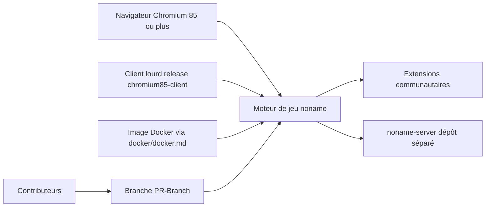

# libccy/noname

> **Jeu de cartes chinois « 无名杀 » jouable en navigateur ou en client, extensible par la communauté.**

## Le problème

Sans ce dépôt, pas de version libre et extensible du jeu de cartes 无名杀 : on dépend de clients
fermés ou de forks obfusqués. Le README ne formule jamais explicitement le problème résolu ; il
part du principe que le lecteur connaît déjà le jeu et vient contribuer ou télécharger.

## Ce que ça fait vraiment

Le README ne décrit ni l'architecture ni les fonctionnalités du jeu. Ce qu'on peut en tirer :
c'est le dépôt de référence du jeu, jouable en page web (moteur Chrome recommandé, version de
noyau ≥ 85) et distribué aussi en client lourd via une release `chromium85-client`, plus un
déploiement Docker documenté dans `docker/docker.md`. Le serveur `noname-server.exe` vit dans un
dépôt séparé, `nonameShijian/noname-server`. Le reste du README est constitué de liens vers le
wiki de contribution et d'une longue mise au point publique contre le fork « 无名杀十周年 »,
accusé de violer la GPL-3.0 et d'obfusquer le produit de code open source.

## Comment c'est branché



Trois portes d'entrée vers le même moteur — page web, client packagé, conteneur Docker — un
serveur hébergé hors du dépôt, et un écosystème d'extensions dont la compatibilité dépend de la
version du cœur (le README insiste : les extensions qui utilisent les fonctions post-1.10 ne
tournent pas sur les forks restés en 1.9.124). Les contributions passent obligatoirement par la
branche `PR-Branch`.

## Essayer

```bash
# Aucune commande d'installation ou de lancement n'est documentée dans ce README.
# Il renvoie vers la release "chromium85-client" et vers ./docker/docker.md,
# dont le contenu n'est pas reproduit ici.
```

Le README ne fournit aucune ligne de commande : rien n'est reconstruit ici.

## Coût et pièges

Gratuit, sans clé d'API ni compte. Le piège principal est juridique et communautaire plutôt que
technique : le code est sous GPL-3.0 (copyleft), ce que le README rappelle longuement à propos
d'un fork accusé de l'avoir violé — toute redistribution ou dérivation impose de publier les
sources. Piège technique signalé : un navigateur ou une webview Android dont le noyau est
antérieur à la version 85 n'est pas supporté, et les vieilles versions de Firefox sont
déconseillées. Enfin, le README est en chinois uniquement et renvoie à un wiki lui aussi en
chinois : sans la langue, la contribution est difficile.

## Ce que ce n'est pas

Ce n'est pas un projet logiciel « généraliste » réutilisable : c'est un jeu, sans API ni
bibliothèque annoncée. Ce n'est pas non plus une documentation technique — plus de la moitié du
README est une prise de position contre un fork, pas une présentation du produit. Et ce n'est
pas « 无名杀十周年 », que le README désigne explicitement comme un fork de la v1.9.124, non
affilié, et non comme une version officielle plus récente.

## Alternatives

Le README ne cite aucune alternative au sens propre. Il mentionne deux dépôts liés :
`nonameShijian/noname-server` (le serveur, complémentaire et non concurrent) et le fork
« 无名杀十周年 », que le README déconseille explicitement. Aucun voisin de catalogue n'a été
fourni : aucune alternative comparable dans le catalogue.

## Pour toi

Sans rapport avec un profil data / IA / MLOps : aucun modèle, aucun pipeline, aucune brique
réutilisable. À classer en curiosité — au mieux comme cas d'école de conflit de licence GPL-3.0
dans une communauté open source. Passer son chemin.
