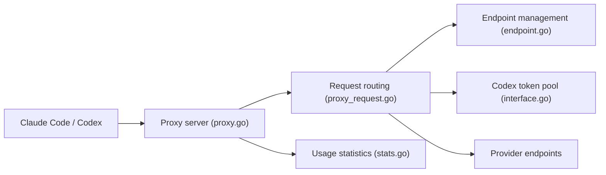

# lich0821/ccNexus

> Proxy local qui route Claude Code et Codex vers plusieurs endpoints, avec bascule et conversion de formats.

## Le problème
Un client de code IA est lié à un seul fournisseur : si l'endpoint tombe, ou si le format d'API diffère, tout s'arrête.

## Ce que ça fait vraiment
Reçoit les requêtes d'un client, choisit un endpoint, convertit au besoin entre formats Claude, OpenAI et Gemini, puis transmet. Rotation automatique en cas d'échec, pool de jetons Codex avec rafraîchissement, statistiques d'usage, synchronisation WebDAV, mode serveur sans interface avec Basic Auth. Écoute sur le port 3000.

## Comment c'est branché


## Essayer
```bash
tar -xzf ccNexus-linux-amd64.tar.gz && ./ccNexus
```

## Coût et pièges
Gratuit ; les clés des fournisseurs restent à ta charge. En mode serveur, ne l'exposer qu'en réseau de confiance ou derrière TLS. README en chinois.

## Ce que ce n'est pas
Pas un fournisseur de modèles. Le pool de jetons Codex importe des identifiants en masse : vérifie que cela respecte les conditions de service concernées.

## Alternatives
Aucune alternative nommée dans le README.

## Pour toi
À surveiller : utile pour jongler entre plusieurs endpoints de code IA ; surveille le risque côté conditions d'usage des jetons.

