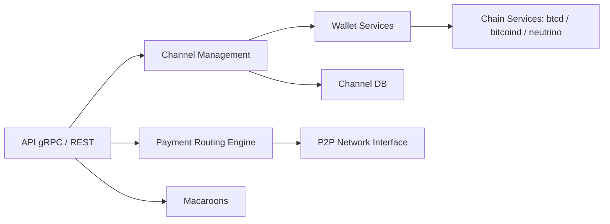

# lightningnetwork/lnd

> Nœud complet du Lightning Network en Go, pour qui gère des canaux de paiement Bitcoin.

## Le problème
Participer au Lightning Network exige un démon qui gère les canaux, le routage et la chaîne Bitcoin sans intermédiaire.

## Ce que ça fait vraiment
Ouvre et ferme des canaux, gère tous leurs états, maintient le graphe de canaux validé, calcule des chemins et relaie ou envoie des paiements chiffrés en oignon. Expose une API gRPC et REST. Le code décrit aussi tour de garde (watchtower), macaroons et autopilot.

## Comment c'est branché


## Essayer
```bash
# Aucune commande de build dans le README : voir docs/INSTALL.md
```
Le README renvoie à docs/INSTALL.md et aux instructions Docker.

## Coût et pièges
Il faut un backend chaîne (btcd, bitcoind ou neutrino) et des fonds réels ; le README qualifie le logiciel de beta et prévient d'une perte de fonds possible si on ignore les consignes de sécurité (docs/safety.md).

## Ce que ce n'est pas
Ce n'est pas un portefeuille grand public ni un outil de data. Les API ne sont pas stables. Le mainnet engage de l'argent réel.

## Alternatives
Aucune alternative nommée dans le README.

## Pour toi
Ignorer : domaine Bitcoin/paiements sans lien avec un profil data/IA/MLOps, sauf projet précis sur Lightning.

