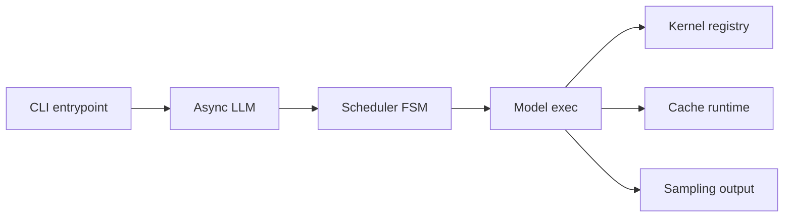

# lightseekorg/tokenspeed

> Moteur d'inférence LLM pour charges agentiques, séparant plan de contrôle C++ et exécution Python.

## Le problème
Les moteurs d'inférence existants mêlent ordonnancement et exécution, et gèrent mal les charges d'agents longues.

## Ce que ça fait vraiment
Un ordonnanceur C++ encode le cycle de vie des requêtes et la propriété du cache KV comme machine à états, tandis que l'exécution est en Python. Une couche de noyaux enfichable choisit entre CUDA, Triton, FlashInfer et TRT-LLM, dont une implémentation MLA sur Blackwell. Le point d'entrée AsyncLLM reçoit les requêtes ; parallélisme, MoE, quantification, décodage spéculatif et séparation prefill/decode sont prévus. Les chiffres comparant à TensorRT-LLM sont ceux du projet.

## Comment c'est branché


## Essayer
Le README ne donne aucune commande : il renvoie à « Getting Started » et « Launching a Server ».
```bash
# aucune commande documentée dans le README
```

## Coût et pièges
GPU récent nécessaire, la performance citée porte sur B200 avec Kimi K2.5. Installation à chercher dans la documentation externe.

## Ce que ce n'est pas
Pas un outil pour un poste sans GPU. Projet récent (mai 2026) ; « le plus performant » est une ambition du README, pas un fait vérifié ici.

## Alternatives
- TensorRT-LLM et vLLM : comparés dans le README.

## Pour toi
Surveiller : à suivre si tu sers des LLM sur GPU récents, mais vLLM reste le choix éprouvé.
