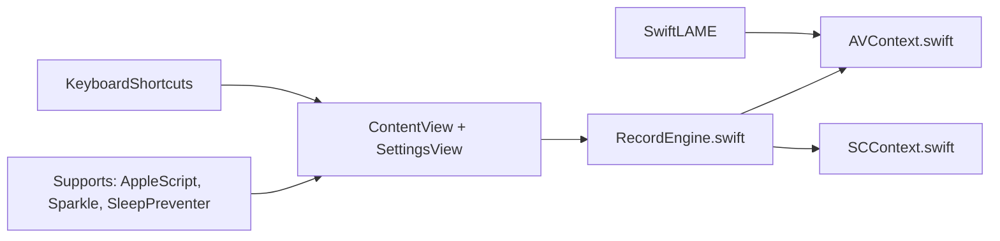

# lihaoyun6/QuickRecorder

> Enregistreur d'écran léger pour macOS : écrans, fenêtres, applications et appareils mobiles.

## Le problème
Enregistrer l'écran d'un Mac avec le son système sans pilote de bouclage audio.

## Ce que ça fait vraiment
Capture écran, fenêtre, application ou appareil mobile, avec audio en boucle sans pilote, surbrillance de la souris, loupe d'écran et superposition caméra (Presenter Overlay sous macOS 14). Il sait écrire du HEVC avec canal alpha. Par défaut le micro est mêlé à la piste principale ; une option le sépare sur deux pistes. Non sandboxée, l'app n'est pas destinée à l'App Store.

## Comment c'est branché


## Essayer
```bash
brew install lihaoyun6/tap/quickrecorder
```

## Coût et pièges
Gratuit. macOS 12.3 minimum. Dernier push en juin 2025, 180 issues ouvertes.

## Ce que ce n'est pas
Ce n'est pas un éditeur vidéo. L'alpha HEVC n'est lu que par iMovie et Final Cut Pro selon le README.

## Alternatives
Aucune alternative nommée dans le README.

## Pour toi
Ignorer : enregistreur d'écran macOS sans lien avec le travail data/IA, licence AGPL-3.0 et activité arrêtée depuis plus d'un an.

