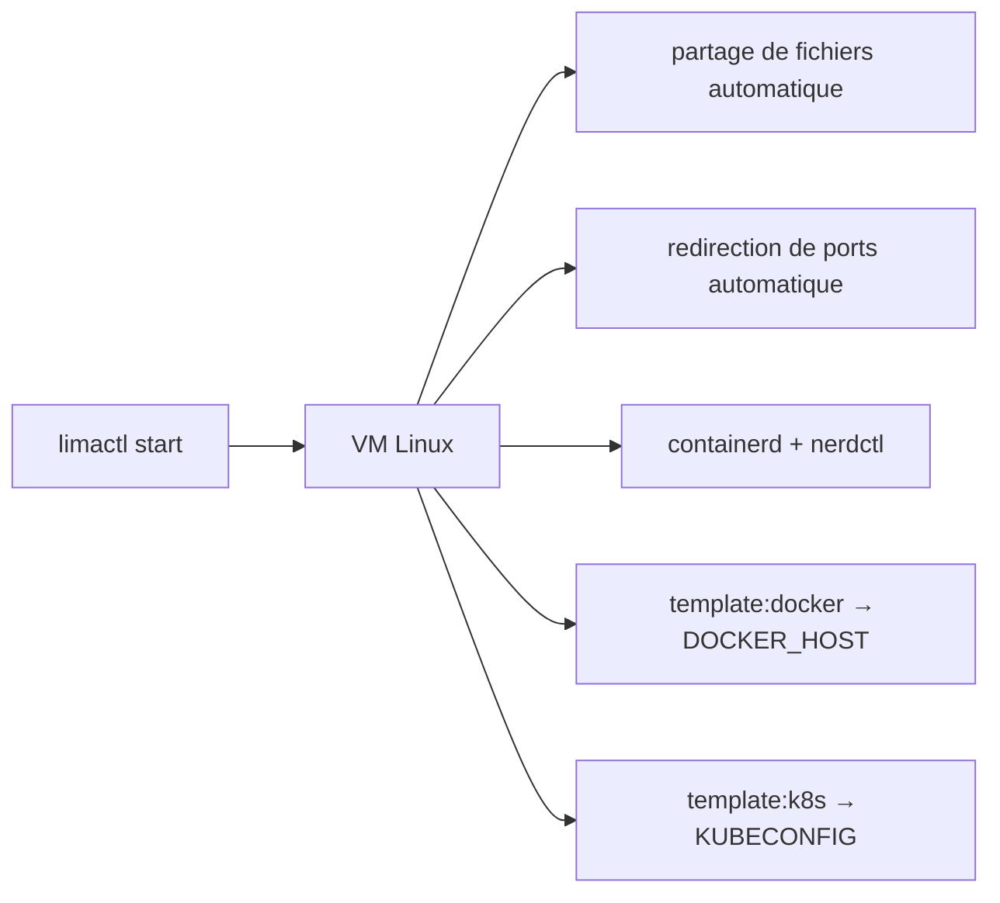

# lima-vm/lima

> Machines virtuelles Linux avec partage de fichiers et redirection de ports automatiques, façon WSL2.

## Le problème
Sur un poste macOS, faire tourner des conteneurs suppose une VM Linux, et la monter à la main
signifie gérer soi-même le partage de fichiers et la redirection de ports.

## Ce que ça fait vraiment
`limactl start` lance une VM Linux ; `lima <commande>` l'exécute dedans. Des gabarits couvrent les
moteurs de conteneurs : `template:docker` (avec un `DOCKER_HOST` sur socket local), `template:k8s`
(avec un `KUBECONFIG` copié depuis l'invité), et containerd/nerdctl par défaut. L'objectif initial
était de promouvoir containerd et nerdctl auprès des utilisateurs Mac, mais Lima sert aussi hors
conteneurs et tourne sur Linux et NetBSD. Depuis la v2.3, les releases embarquent des SBOM CycloneDX,
en variantes « app » (dépendances réellement compilées) et « mod » (agrégat du module).

## Comment c'est branché


## Essayer
```bash
brew install lima
limactl start
lima uname -a
lima nerdctl run --rm hello-world
limactl start template:docker
export DOCKER_HOST=$(limactl list docker --format 'unix://{{.Dir}}/sock/docker.sock')
```

## Coût et pièges
Gratuit. Le coût est celui d'une VM : RAM et disque réservés sur le poste. Le README ne détaille ni
les prérequis matériels, ni la licence, et renvoie la configuration fine à la documentation.

## Ce que ce n'est pas
Pas un moteur de conteneurs : Lima fournit la VM, containerd, Docker ou Kubernetes tournent dedans.
Pas une interface graphique — le README renvoie à des projets tiers pour ça. Pas exclusivement macOS.

## Alternatives
- Colima : Docker et Kubernetes sur macOS avec un minimum de configuration.
- Rancher Desktop : gestion Kubernetes et conteneurs avec interface de bureau.
- Podman Desktop : dispose d'un greffon pour les VM Lima.

## Pour toi
La base propre pour un environnement conteneurisé reproductible sur poste, sans Docker Desktop.
