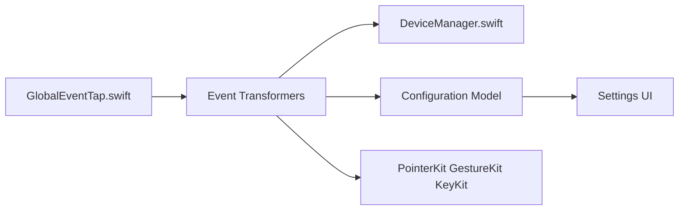

# linearmouse/linearmouse

> Utilitaire macOS pour régler la souris et le pavé tactile (vitesse, défilement, boutons).

## Le problème
macOS applique une accélération et un défilement fixes qui conviennent mal à certaines souris externes.

## Ce que ça fait vraiment
Le README est très court (renvoi vers linearmouse.app, guide de contribution, traduction via Crowdin). D'après le code : interception des événements par un Event Tap global, chaîne de transformateurs (boutons, défilement, pointeur), gestion par appareil, configuration en modèle, modules Swift GestureKit, KeyKit et PointerKit. Nécessite l'autorisation d'accessibilité de macOS.

## Comment c'est branché

## Essayer
Aucune commande documentée dans le README : voir https://linearmouse.app.

## Coût et pièges
Gratuit. Demande l'accès Accessibilité de macOS (interception d'événements).

## Ce que ce n'est pas
Pas une application multiplateforme : macOS uniquement. Le README ne détaille pas les fonctions.

## Alternatives
Mac Mouse Fix, cité comme source d'inspiration pour la vitesse du pointeur.

## Pour toi
À ignorer : utilitaire de confort sur Mac, sans rapport avec un travail data/IA/MLOps.

