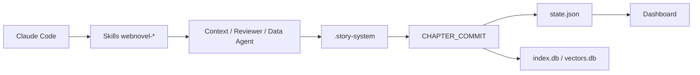

# lingfengQAQ/webnovel-writer

> Plugin Claude Code pour écrire des romans-feuilletons chinois longs en gardant la cohérence narrative.

## Le problème
Au-delà de quelques dizaines de chapitres, un LLM oublie personnages, chronologie et intrigues secondaires.

## Ce que ça fait vraiment
Huit commandes (`/webnovel-init`, `-plan`, `-write`, `-review`, `-query`, `-learn`, `-dashboard`, `-doctor`) orchestrent des agents contexte, relecteur et données.
Chaque chapitre produit un `CHAPTER_COMMIT` dans `.story-system/`, source unique de vérité, projeté vers `state.json`, `index.db`, résumés et mémoire.
La recherche combine RAG (embedding + rerank compatibles OpenAI) avec repli BM25.
Un tableau de bord React en lecture seule affiche l'état du projet ; 37 gabarits de genres chinois.

## Comment c'est branché


## Essayer
```bash
claude plugin marketplace add lingfengQAQ/webnovel-writer --scope user
claude plugin install webnovel-writer@webnovel-writer-marketplace --scope user
python -m pip install -r https://raw.githubusercontent.com/lingfengQAQ/webnovel-writer/HEAD/requirements.txt
cp .env.example .env
```

## Coût et pièges
Abonnement Claude Code et clés d'embedding/rerank à ta charge ; README sponsorisé par des revendeurs d'API.
Branche master en maintenance (v6), la v8 est en cours sur une autre base.

## Ce que ce n'est pas
Pas un outil généraliste d'écriture : conçu pour la web-fiction chinoise, documentation en chinois.
Pas utilisable hors Claude Code.

## Alternatives
Aucune alternative nommée dans le README (seul `oh-story-claudecode` est cité comme inspiration).

## Pour toi
À ignorer pour ton profil : cas d'usage littéraire hors sujet, même si le motif « commit d'événements + projections » est une idée de mémoire d'agent à retenir.
