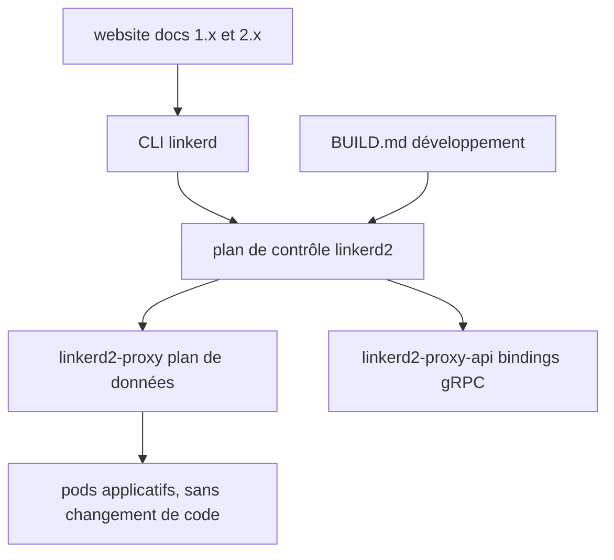

# linkerd/linkerd2

> Maillage de services Kubernetes léger et orienté sécurité, sans modification du code applicatif.

## Le problème
Chiffrer les communications entre services, les observer et les rendre fiables suppose d'habitude de toucher à chaque application.
Les maillages de services proposés pour y répondre sont eux-mêmes lourds à exploiter.

## Ce que ça fait vraiment
Ajoute sécurité, observabilité et fiabilité à une pile Kubernetes sans changement de code, d'après le README.
Ce dépôt contient le plan de contrôle et le CLI de la ligne 2.x ; le proxy de plan de données vit dans `linkerd2-proxy`, les bindings gRPC dans `linkerd2-proxy-api`.
Le README est une page d'aiguillage : installation et usage sont renvoyés au Getting Started Guide et au dépôt `website`.
Projet CNCF, avec comité de pilotage, réunions publiques et audits de sécurité tiers publiés.

## Comment c'est branché

## Essayer
Aucune commande documentée dans ce README : il renvoie au Getting Started Guide et à `BUILD.md`.

## Coût et pièges
Gratuit et CNCF ; il faut un cluster Kubernetes « moderne », donc le coût est celui de l'infrastructure.
Piège de lecture : ce README ne documente rien d'opérationnel, tout est dans le dépôt `website`.

## Ce que ce n'est pas
Pas Linkerd 1.x : celui-ci vit dans le dépôt `linkerd`, séparé.
Pas le proxy : le plan de données n'est pas dans ce dépôt.
Pas une documentation : c'est une page d'index vers les guides et les canaux communautaires.

## Alternatives
- linkerd (1.x) : la ligne précédente, si vous êtes hors Kubernetes.

## Pour toi
À connaître de nom pour du mTLS entre services ; ce README ne suffit pas à décider, il faut aller au site.
