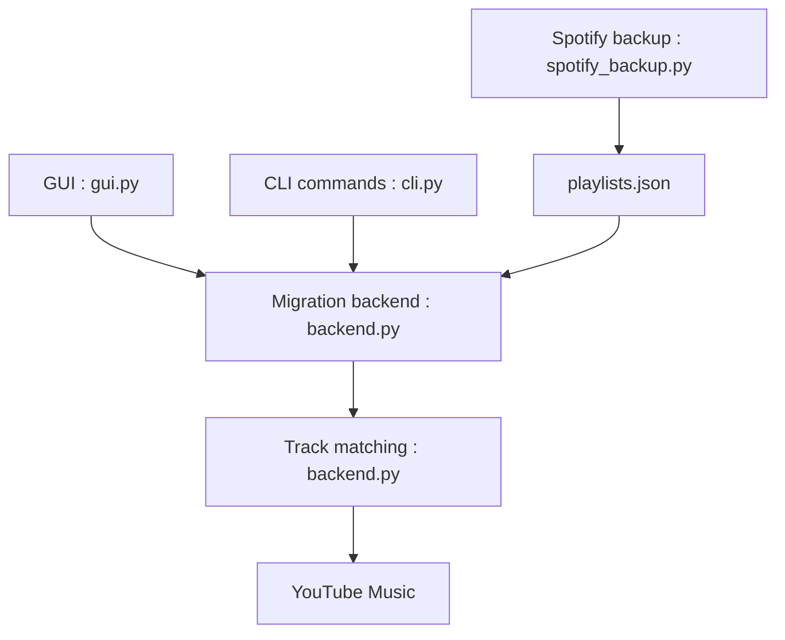

# linsomniac/spotify_to_ytmusic

> Scripts et interface graphique pour copier titres aimés et playlists de Spotify vers YouTube Music.

## Le problème
Changer de plateforme musicale sans recréer à la main ses playlists.

## Ce que ça fait vraiment
Sauvegarde Spotify en `playlists.json`, puis recherche chaque titre sur YouTube Music (album du même artiste, puis recherche de chansons) et l'ajoute. Fonctionne via GUI ou ligne de commande. Relancer ne duplique pas les entrées, d'après le README. Les identifiants YouTube Music s'obtiennent en copiant des en-têtes du navigateur.

## Comment c'est branché


## Essayer
```bash
git clone https://github.com/linsomniac/spotify_to_ytmusic.git
cd spotify_to_ytmusic
python3 -m venv .venv && source .venv/bin/activate
pip install ytmusicapi tk
python3 -m spotify2ytmusic gui
```

## Coût et pièges
Gratuit. Comptes Spotify et YouTube Music requis. Les copies longues peuvent échouer (session expirée, erreurs HTTP 400) ; le README suggère `--track-sleep=3`. Certaines commandes du README apparaissent avec des arguments manquants.

## Ce que ce n'est pas
Pas un service géré ni une application mobile (« No, this runs on Linux/Windows/MacOS »). L'appariement des titres obscurs peut échouer.

## Alternatives
Aucune alternative nommée dans le README.

## Pour toi
À surveiller : sans rapport avec data/IA, mais un utilitaire pratique pour migrer ses playlists ; surtout s'appuie sur une API non officielle.

