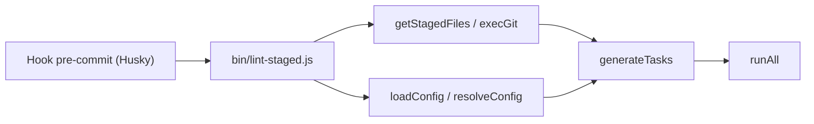

# lint-staged/lint-staged

> Outil Node.js qui lance formateurs et linters uniquement sur les fichiers indexés par git avant un commit.

## Le problème
Lancer un formateur ou un linter sur tout le projet est lent et remonte des erreurs sans rapport avec le commit ; on veut ne contrôler que ce qui va être commité.

## Ce que ça fait vraiment
Il liste les fichiers indexés, les filtre par motif (glob) et lance les commandes configurées avec ces fichiers en argument. Il sauvegarde l'état dans un `git stash`, masque les modifications non indexées des fichiers partiellement indexés, re-indexe les corrections faites par les outils et restaure l'état en cas d'échec. Les tâches tournent en parallèle par défaut ; configuration en JSON, YAML, JS ou TypeScript.

## Comment c'est branché


## Essayer
```bash
npm install --save-dev lint-staged
npx lint-staged --help
npx lint-staged --all
npx lint-staged --diff="main...my-branch"
```

## Coût et pièges
Gratuit. Exige de brancher un hook git (Husky recommandé) et d'installer soi-même les outils. Il modifie l'état git : la sauvegarde par stash aide, mais un processus interrompu demande une restauration manuelle. Deux tâches qui éditent le même fichier en parallèle créent une condition de course.

## Ce que ce n'est pas
Ce n'est pas un linter ni un formateur : il ne fait qu'orchestrer les tiens. Il ne remplace pas la CI.

## Alternatives
Le README propose `lint-staged.sh`, un script shell plus simple qui vérifie sans modifier ; et cite Husky pour installer les hooks.

## Pour toi
Adopter : cheap et éprouvé pour garder propre un dépôt de code ou de notebooks avec des vérifications rapides avant commit ; nécessite Node, même dans un projet Python.

