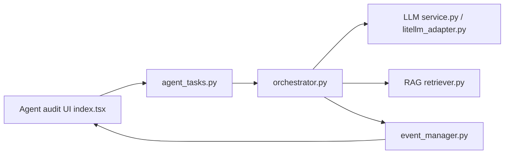

# lintsinghua/DeepAudit

> Plateforme d'audit de code par agents LLM, pour équipes sécurité qui veulent moins de faux positifs.

## Le problème
Les outils d'analyse statique produisent beaucoup de faux positifs, ignorent la logique métier entre fichiers et ne disent pas si une faille est réellement exploitable.

## Ce que ça fait vraiment
- Importe un projet (GitHub/GitLab/Gitea ou ZIP) et lance un audit par agents : Orchestrator, Recon, Analysis, Verification (`orchestrator.py`, `recon.py`, `analysis.py`, `verification.py`).
- L'analyse s'appuie sur une base RAG (CWE/CVE), l'AST et Semgrep ; les résultats suivent en direct dans l'interface.
- L'agent de vérification écrit un script de test et l'exécute dans un conteneur Docker isolé pour confirmer la faille ; les faux positifs sont écartés.
- Rapports exportables en PDF, Markdown, JSON ; modèles OpenAI, Claude, Gemini, DeepSeek, Qwen, ou Ollama en local.

## Comment c'est branché


## Essayer
```bash
curl -fsSL https://raw.githubusercontent.com/lintsinghua/DeepAudit/v3.0.0/docker-compose.prod.yml | docker compose -f - up -d
# interface : http://localhost:3000
# ou depuis les sources :
git clone https://github.com/lintsinghua/DeepAudit.git && cd DeepAudit
cp backend/env.example backend/.env
docker compose up -d
```

## Coût et pièges
Clé d'API LLM facturée à l'usage (ou Ollama local). Sans modèle local, le code audité part chez le fournisseur choisi, ce que le README signale.

## Ce que ce n'est pas
Ce n'est pas un outil pour tester des systèmes tiers : le README interdit tout test non autorisé et réserve l'usage à la recherche et à des environnements autorisés. La version citée pour les CVE est la version fermée, pas ce dépôt. Licence AGPL-3.0.

## Alternatives
Semgrep (intégré à l'analyse de base) pour une analyse statique sans LLM ; Strix et Kunlun-M, cités en remerciements, pour des approches voisines.

## Pour toi
Surveiller : intéressant comme exemple d'orchestration multi-agents avec RAG et vérification en bac à sable ; à n'utiliser que sur du code que tu as le droit d'auditer, et prévoir le coût LLM.

