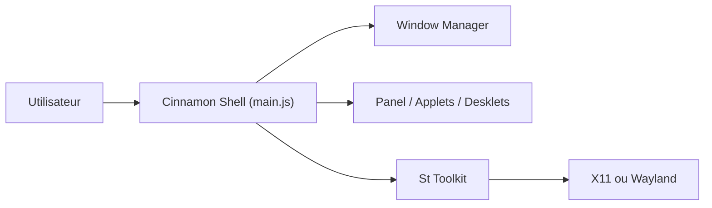

# linuxmint/cinnamon

> Environnement de bureau Linux à disposition traditionnelle, dérivé de GNOME Shell.

## Le problème
README trop court (moins de 800 caractères) : le problème traité n'y est pas décrit. Il vise les utilisateurs qui veulent une disposition proche de GNOME 2.

## Ce que ça fait vraiment
Fournit un bureau Linux (le README ne détaille rien). D'après le code : shell, gestion de fenêtres, panneaux, applets, desklets, espaces de travail, notifications, économiseur d'écran, gestion de session.

## Comment c'est branché


## Essayer
```bash
# Aucune commande documentée dans le README.
```

## Coût et pièges
Non documenté. Les problèmes peuvent venir de composants liés : le README renvoie vers une liste sur le site du projet.

## Ce que ce n'est pas
Pas une distribution : c'est l'environnement de bureau de Linux Mint (d'après le propriétaire du dépôt). Licence GPL v2 ou ultérieure.

## Alternatives
GNOME Shell : dont Cinnamon est un fork, selon le README.

## Pour toi
À ignorer : un bureau ne sert pas un travail data/IA en soi, et le README ne permet pas d'en dire plus.

