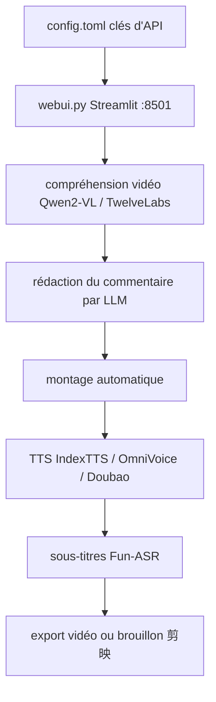

# linyqh/NarratoAI

> Outil de commentaire vidéo automatisé : écriture, montage, doublage et sous-titres en un flux.

## Le problème
Produire une vidéo de commentaire de film enchaîne écriture, découpe, voix off et sous-titres, chacun avec son outil.
Les modèles de compréhension vidéo et de TTS changent vite, donc le montage maison se périme.

## Ce que ça fait vraiment
Pipeline unique piloté par LLM : rédaction du texte, montage automatique, doublage, génération de sous-titres, exporté aussi en brouillon 剪映.
Compréhension vidéo par Qwen2-VL ou, en option, TwelveLabs Pegasus (`vision_llm_provider = "twelvelabs"`) pour choisir les temps forts.
Moteurs TTS multiples dont clonage de voix IndexTTS-1.5 (MLX pour Apple Silicon), IndexTTS-2 MLX, OmniVoice, TTS Doubao et Tencent Cloud ; transcription en un clic via Fun-ASR.
UI Streamlit sur `http://127.0.0.1:8501`, en paquet tout-en-un Windows/macOS, Docker ou lancement local via `uv`.

## Comment c'est branché


## Essayer
```bash
git clone https://github.com/linyqh/NarratoAI.git
cd NarratoAI
docker compose up -d
uv sync
cp config.example.toml config.toml
uv run streamlit run webui.py --server.maxUploadSize=2048
xattr -cr "/path/to/NarratoAI-macos-arm64"
```

## Coût et pièges
Le README pousse plusieurs fournisseurs d'API sponsorisés avec codes de parrainage : les clés et la consommation sont à votre charge.
Matériel annoncé : 4 cœurs et 8 Go de RAM au minimum, Python 3.12+, carte graphique non obligatoire. L'auteur signale aussi des revendeurs qui renomment et vendent ce logiciel gratuit.

## Ce que ce n'est pas
Pas un éditeur vidéo manuel : c'est un pipeline automatique, l'ajustement fin passe par l'export vers 剪映.
Pas indépendant de services tiers : compréhension vidéo, LLM et TTS cloud demandent des comptes.
Pas documenté en anglais dans ce bloc : le contenu fourni est en chinois, hors quelques liens.

## Alternatives
- FujiwaraChoki/MoneyPrinter et harry0703/MoneyPrinterTurbo : projets dont celui-ci est une refonte, cités par l'auteur.

## Pour toi
Hors de ton périmètre : outil de production de contenu, avec sponsors et parrainages en avant.
