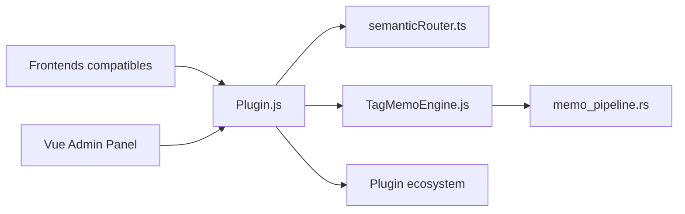

# lioensky/VCPToolBox

> Plateforme d'agents IA à mémoire persistante, plugins et routage de modèles, pour bricoleurs d'agents sans limite de complexité.

## Le problème
Les agents classiques repartent de zéro à chaque requête : pas de mémoire continue, pas de perception de l'environnement, outils fragiles.

## Ce que ça fait vraiment
Serveur Node qui assemble le contexte avant chaque appel : mémoire associative (moteur « TagMemo », noyau Rust RiverMemo), fil unifié multi-front, repli de contexte, routage sémantique de modèles. Outils appelés par balises texte (sans function calling natif), plus de 300 plugins annoncés, nœuds distribués, forum d'agents, panneau d'admin Vue. Le code serait écrit en majorité par 8 agents IA.

## Comment c'est branché


## Essayer
```bash
git clone https://github.com/lioensky/VCPToolBox.git
cd VCPToolBox
npm install
pip install -r requirements.txt
cp config.env.example config.env
node server.js
```

## Coût et pièges
Clés d'API à ta charge. Le README interdit les API relais ou miroirs : les agents ont des droits profonds. Licence CC BY-NC-SA 4.0 : usage non commercial seulement.

## Ce que ce n'est pas
Pas un simple framework d'outils ; le texte est surtout philosophique, avec peu de mesures vérifiables.

## Alternatives
Aucune alternative nommée dans le README (VCPChat est le front recommandé).

## Pour toi
À surveiller : idées de mémoire intéressantes, mais licence non commerciale, mainteneur unique et README plus manifeste que preuve ; inadapté à un usage pro.

