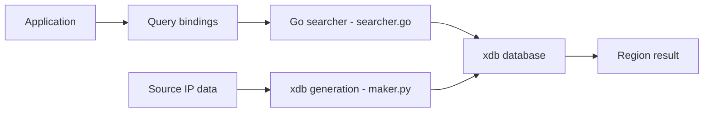

# lionsoul2014/ip2region

> Bibliothèque hors ligne de localisation IP (IPv4/IPv6) au format xdb, avec clients dans de nombreux langages.

## Le problème
Géolocaliser une adresse IP sans appeler un service externe, avec une latence de l'ordre de la microseconde.

## Ce que ça fait vraiment
Fournit des données source IPv4/IPv6 et des fichiers `xdb` (champs : pays|province|ville|opérateur|code ISO). Le format fusionne et déduplique les plages. Réponse à 10 µs en chargeant tout le xdb en mémoire, environ 100 µs avec l'index vectoriel (512 Kio). Clients de requête (Go, Java, Python, Rust, C, JS, PHP, C#, Nginx…) et générateurs xdb.

## Comment c'est branché

## Essayer
Aucune commande unique dans le README : chaque client (`searcher`) et générateur (`maker`) a son propre README.

## Coût et pièges
Gratuit. Les données sont mises à jour irrégulièrement ; le README recommande des données commerciales pour une précision élevée. Les régions chinoises sont en chinois, les autres en anglais.

## Ce que ce n'est pas
Pas un service de géolocalisation précis à jour. Pas une API distante. Licence non identifiée par GitHub.

## Alternatives
Aucune alternative nommée dans le README (des données commerciales y sont mentionnées sans nom).

## Pour toi
À surveiller : utile pour enrichir des logs ou jeux de données hors ligne, à condition d'accepter des données approximatives et de vérifier la licence.

