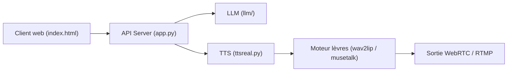

# lipku/LiveTalking

> Moteur d'humain numérique en temps réel : anime un avatar dont les lèvres suivent la voix, en flux audio-vidéo.

## Le problème
Créer un présentateur virtuel réactif (livestream, service client) exige d'assembler synthèse vocale, modèle de synchronisation labiale et diffusion vidéo à faible latence.

## Ce que ça fait vraiment
Reçoit du texte ou de l'audio, appelle éventuellement un LLM, synthétise la voix (EdgeTTS, GPT-SoVITS, CosyVoice, Tencent), génère les mouvements de lèvres avec Wav2Lip, MuseTalk, ERNeRF ou Ultralight, puis diffuse en WebRTC, RTMP ou caméra virtuelle. Gère l'interruption de parole, plusieurs sessions et le clonage de voix. Une version commerciale payante existe à côté de l'open source.

## Comment c'est branché


## Essayer
```bash
git clone https://github.com/lipku/LiveTalking.git
conda create -n livetalking python=3.12
conda activate livetalking
pip install -r requirements.txt
python app.py --transport webrtc --model wav2lip --avatar_id wav2lip256_avatar1
```

## Coût et pièges
Gratuit côté code, mais il faut un GPU (RTX 3060 minimum pour wav2lip256), télécharger les modèles à la main et ouvrir les ports TCP 8010 et UDP. Les vidéos publiées doivent porter le filigrane LiveTalking.

## Ce que ce n'est pas
Pas une solution clé en main : les fonctions avancées sont réservées à la version commerciale.

## Alternatives
Aucune alternative nommée dans le README.

## Pour toi
À surveiller : un bon banc d'essai pour avatar conversationnel sur GPU local, mais l'obligation de filigrane et la version payante limitent l'usage.

