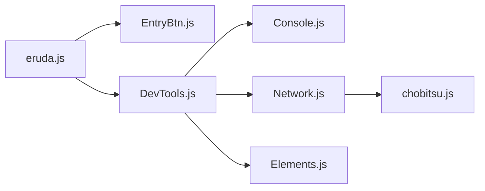

# liriliri/eruda

> Console de débogage embarquée dans la page pour navigateurs mobiles, pour développeurs web.

## Le problème
Sur téléphone, il n'y a pas d'outils de développement : impossible d'inspecter console, réseau ou DOM.

## Ce que ça fait vraiment
On charge le script et on appelle `eruda.init()` : un bouton ouvre une interface d'outils (console, réseau, éléments, ressources, stockage, cookies, sources, snippets, infos, réglages). Le réseau passe par un adaptateur de protocole (chobitsu, implémentation JS du protocole DevTools). Une documentation en ligne détaille l'usage.

## Comment c'est branché


## Essayer
```bash
npm install eruda --save-dev
```
```html
<script src="node_modules/eruda/eruda.js"></script>
<script>eruda.init();</script>
```

## Coût et pièges
Gratuit. Dernier push en août 2025. Ne pas laisser la console active en production publique.

## Ce que ce n'est pas
Pas un débogueur distant : pour cela, le README cite le projet séparé chii.

## Alternatives
chii : outil de débogage à distance du même auteur.

## Pour toi
Utile si tu construis une app web consultée sur mobile ; peu de lien avec un pipeline data/IA.

