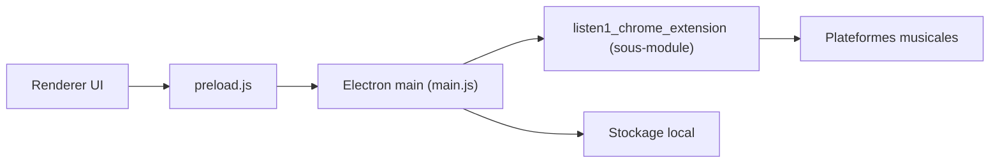

# listen1/listen1_desktop

> Lecteur de musique de bureau qui agrège plusieurs plateformes musicales chinoises.

## Le problème
Écouter des morceaux répartis sur plusieurs sites musicaux oblige à jongler entre applications.

## Ce que ça fait vraiment
Application Electron qui cherche et lit des titres de plusieurs plateformes (NetEase, QQ Music, Kugou, Kuwo, bilibili, Migu, Qianqian), avec favoris et listes de lecture. La logique de recherche et lecture vient d'un sous-module partagé avec l'extension Chrome ; aucun serveur propre.

## Comment c'est branché


## Essayer
```bash
git submodule update --init --recursive
npm run start
npm run dist
```

## Coût et pièges
Gratuit. Dépend des API de sites tiers, susceptibles de changer. README en chinois ; 958 issues ouvertes.

## Ce que ce n'est pas
Pas un service de musique : il lit les contenus des plateformes tierces. Dernier push le 2026-04-07.

## Alternatives
Aucune alternative nommée dans le README.

## Pour toi
Ignorer : lecteur musical grand public, hors périmètre data/IA/MLOps.

