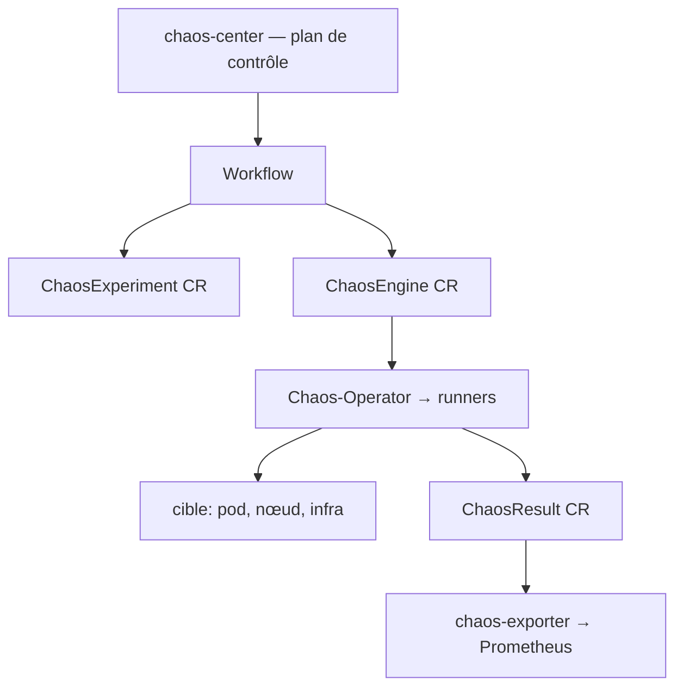

# litmuschaos/litmus

> Plateforme CNCF d'ingénierie du chaos pour Kubernetes, pilotée par ressources personnalisées.

## Le problème
On découvre les faiblesses d'un déploiement le jour de la panne, pas avant.
Injecter des pannes à la main n'est ni reproductible ni mesurable.

## Ce que ça fait vraiment
Trois CRD structurent tout : `ChaosExperiment` (paramètres et permissions d'une faute, installable comme template), `ChaosEngine` (lie une charge, un nœud ou une infra à cette faute, avec sondes de validation d'état stable), `ChaosResult` (résultat, rollback et verdict).
Le plan de contrôle `chaos-center` construit, planifie et visualise les workflows de chaos ; le plan d'exécution est un agent plus des opérateurs dans l'environnement ciblé.
Le `ChaosExperiment` supporte le BYOC — brancher un outil tiers pour l'injection de faute — plutôt que d'imposer sa bibliothèque.
Le `chaos-exporter` lit les résultats et les expose en métriques Prometheus, ce qui rend les runs automatisés exploitables.

## Comment c'est branché


## Essayer
Aucune commande n'est donnée dans le README : il renvoie à la section Installation de la page « Getting Started with Litmus » de la documentation.

```bash
# aucune commande documentée dans le README — voir les Litmus Docs
```

## Coût et pièges
Gratuit et CNCF, mais il faut un cluster Kubernetes et accepter que la plateforme tourne elle-même comme un ensemble de microservices.
Les expériences viennent d'un hub public (`hub.litmuschaos.io`) alimenté par des développeurs et éditeurs tiers : à auditer avant exécution en production.

## Ce que ce n'est pas
Ce n'est pas un outil ponctuel d'injection de panne : c'est une plateforme avec plan de contrôle, agents et opérateurs.
Ce n'est pas limité aux développeurs non plus — les trois usages affichés sont dev, pipeline CI/CD et SRE.
Le README est surtout une liste de conférences et de billets : la substance technique tient dans la description des CRD.

## Alternatives
Aucune alternative n'est nommée dans le README.

## Pour toi
Utile le jour où tes services d'inférence ont un SLO ; jusque-là, c'est de l'outillage SRE, pas data.
