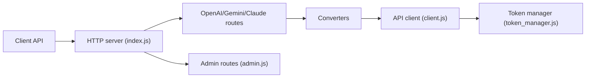

# liuw1535/antigravity2api-nodejs

> Proxy Node.js qui expose l'API Google Antigravity au format OpenAI, Gemini ou Claude, multi-comptes.

## Le problème
Utiliser les modèles d'un service Google non destiné à l'API générique depuis des clients OpenAI, Gemini ou Claude.

## Ce que ça fait vraiment
Reçoit des requêtes aux trois formats, les convertit, puis appelle Antigravity avec rotation de comptes OAuth, rafraîchissement des jetons et suivi des quotas. Gère flux, outils, images, sortie structurée, raisonnement. Interface web d'administration, compatibilité SD WebUI, binaires précompilés. Port 8045.

## Comment c'est branché


## Essayer
```bash
npm install
cp .env.example .env
cp config.json.example config.json
npm run login
npm start
```

## Coût et pièges
Demande des comptes Google et stocke leurs jetons en clair dans data/accounts.json. Identifiants par défaut faibles (admin/admin123). Le README mentionne un contournement de qualification (ProjectId aléatoire) : risque de blocage de compte.

## Ce que ce n'est pas
Pas un service officiel ; il peut cesser de fonctionner. La licence est présente mais non identifiée par GitHub.

## Alternatives
Aucune alternative nommée dans le README.

## Pour toi
À ignorer : contournement de limites d'un service tiers avec jetons sensibles, licence floue ; privilégie les API officielles.

