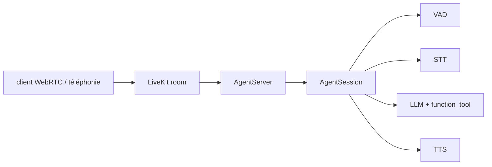

# livekit/agents

> Framework Python pour bâtir des agents vocaux temps réel qui tournent côté serveur.

## Le problème
Assembler une conversation vocale demande d'orchestrer VAD, transcription, LLM, synthèse et
transport WebRTC, chacun avec sa latence et ses reprises de parole.

## Ce que ça fait vraiment
Le framework fournit des participants programmables temps réel : `Agent` (instructions + outils),
`AgentSession` (conteneur gérant les interactions), `entrypoint` et `AgentServer` (ordonnancement
des jobs). Il branche au choix STT/LLM/TTS séparés ou une API Realtime, détecte la fin de tour par
un modèle transformer, supporte MCP nativement, la téléphonie, et embarque un framework de test avec
juges LLM (`result.expect.next_event().is_function_call(...)`).

## Comment c'est branché


## Essayer
```bash
pip install "livekit-agents[openai,deepgram,cartesia]"
python myagent.py console
python myagent.py dev
python myagent.py start
uv run pytest --unit
```

## Coût et pièges
Le code est gratuit, les modèles non : il faut `LIVEKIT_URL`, `LIVEKIT_API_KEY`,
`LIVEKIT_API_SECRET`, plus des clés pour Deepgram, OpenAI, Cartesia ou l'inférence hébergée
LiveKit Cloud. Les tests d'intégration des plugins exigent divers identifiants d'API.

## Ce que ce n'est pas
Ce n'est pas un modèle vocal : c'est l'orchestration autour de modèles tiers. Le mode `console`
tourne en local, mais les modes `dev` et `start` supposent un serveur LiveKit — Cloud ou auto-hébergé.
Ce n'est pas la version JS : celle-ci s'appelle AgentsJS.

## Alternatives
Aucune alternative externe n'est nommée dans le README ; il pointe seulement vers AgentsJS,
l'équivalent JS/TS du même éditeur.

## Pour toi
À regarder si tu prototypes un assistant vocal ; le coût réel se joue sur les fournisseurs STT/TTS,
pas sur le framework.
