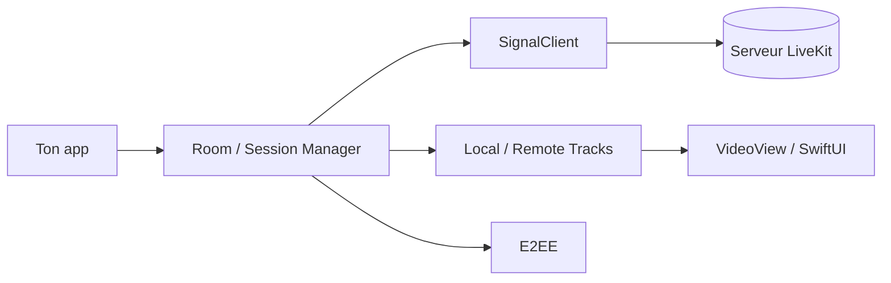

# livekit/client-sdk-swift

> SDK Swift pour ajouter vidéo, audio et données temps réel à une app iOS ou macOS via LiveKit.

## Le problème
Construire appels vidéo, diffusion ou interfaces d'IA vocale sur mobile impose de gérer WebRTC, la signalisation et la session audio.

## Ce que ça fait vraiment
Fournit `Room` pour se connecter à un serveur LiveKit (Cloud ou auto-hébergé), publier caméra et micro, s'abonner aux pistes, envoyer des flux de données, chiffrer de bout en bout et partager l'écran. Livré avec `VideoView` UIKit et des composants SwiftUI. Il gère la session audio et l'intégration CallKit.

## Comment c'est branché

## Essayer
Ajouter le paquet dans `Package.swift` : `.package(name: "LiveKit", url: "https://github.com/livekit/client-sdk-swift.git", .upToNextMajor("2.17.0"))`. Une distribution XCFramework précompilée est proposée dans un dépôt séparé.

## Coût et pièges
Un serveur LiveKit est requis (LiveKit Cloud freemium ou auto-hébergé). Publier la caméra n'est pas possible sur le simulateur iOS. CocoaPods est déprécié.

## Ce que ce n'est pas
Ce n'est pas le framework d'agents vocaux : le README renvoie à LiveKit Agents (Python, Node.js). Ce dépôt est le côté client mobile.

## Alternatives
- LiveKit Agents : SDK pour agents vocaux côté serveur.
- client-sdk-swift-xcframework : la même chose précompilée.

## Pour toi
À ignorer : SDK client mobile ; seul LiveKit Agents (autre dépôt) concerne un profil IA, ce dépôt-ci non.

