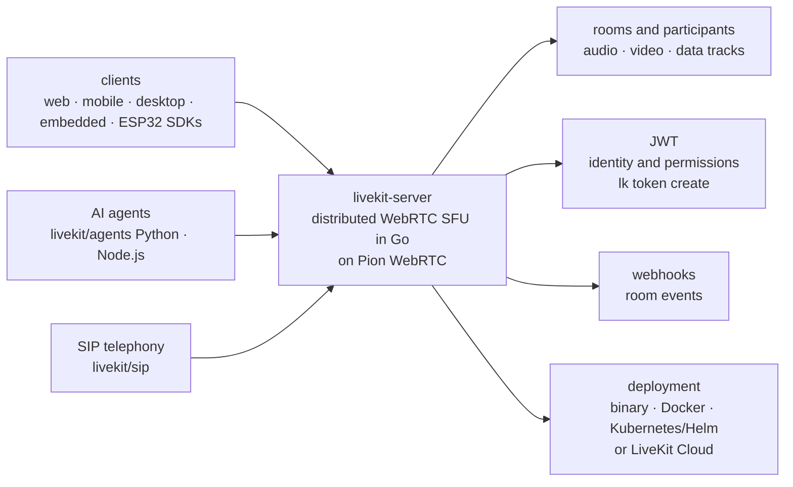

# livekit/livekit

> **The WebRTC server that puts people, devices and AI agents in one realtime room.**

## The problem

Moving realtime audio and video between a browser, a phone and a model means wiring signalling,
TURN, codecs, selective subscription and multi-region scaling yourself — an infrastructure
project with nothing to do with the product you meant to build.

## What it actually does

LiveKit server is a distributed WebRTC SFU (Selective Forwarding Unit) written in Go, built on
the [Pion WebRTC](https://github.com/pion/webrtc) implementation. It forwards audio, video and
data tracks between the participants of a room, without mixing or re-encoding.

People, devices and AI agents join as the same kind of participant, with an agent dispatch
mechanism that routes agents in automatically or on demand. Authentication uses JWT access
tokens encoding identity and room permissions.

On the network side it handles UDP/TCP/TURN, simulcast, selective subscription, speaker
detection, SVC codecs (VP9, AV1), end-to-end encryption, low-latency data tracks, webhooks and
distributed multi-region deployment.

It ships as a single binary, a Docker image or a Kubernetes deployment (official images and
Helm charts published). Telephony (SIP), recording (Egress) and ingestion (Ingress) are
**separate** services of the same ecosystem, not features of this repository.

## How it is wired

No code-derived diagram exists for this repository: the graph below is rebuilt from the README
alone, so it carries no real file names.



## Trying it

```bash
brew install livekit
```

```bash
curl -sSL https://get.livekit.io | bash
```

Then, commands copied from the README, in typing order: start the server in development mode
with `livekit-server --dev` (key `devkey`, secret `secret`), create a token, and join the room
with a test publisher.

```bash
lk token create \
    --api-key devkey --api-secret secret \
    --join --room my-first-room --identity user1 \
    --valid-for 24h

lk room join \
    --url ws://localhost:7880 \
    --api-key devkey --api-secret secret \
    --identity bot-user1 \
    --publish-demo \
    my-first-room
```

From source (stated prerequisites: Go 1.26+ and `GOPATH/bin` on the `PATH`):

```bash
git clone https://github.com/livekit/livekit
cd livekit
./bootstrap.sh
mage
```

## Cost and gotchas

- **The server is free** and Apache 2.0 licensed: no API key to pay for when self-hosting. The
  `devkey`/`secret` pair of `--dev` mode is a placeholder — the README points to the deployment
  docs for production.
- **The README's default path is LiveKit Cloud**: 19+ regions, 99.99% uptime claimed, free Build
  plan with no credit card, but agent hosting, model inference, telephony and observability sit
  *on top of* the server. Hence the alert: the most visible parts of the headline demo (LiveKit
  Inference, "no per-provider API keys") are SaaS features, not repository features.
- **Without Cloud the keys come back**: the README states that when running self-hosted you use
  model plugins in place of LiveKit Inference — so one key per STT/LLM/TTS provider, on you.
- **Separate tooling**: the README recommends installing `livekit-cli` alongside the server;
  without it there is no `lk token create` and no test traffic.
- **CPU and bandwidth, not GPU**: an SFU relays streams. The README documents no sizing figures
  (RAM, cores, throughput per room).
- **TURN and multi-region are operational projects** in their own right, deferred to the
  distributed self-hosting docs.

## What it is not

- **Not a voice-agent framework.** The README sends you straight to `livekit/agents` (Python and
  Node.js) for STT/LLM/TTS, turn detection and tool calling. This repository moves media; it
  does no transcription and no synthesis.
- **Not a video-conferencing app**: LiveKit Meet, spatial audio and the OBS livestream are
  examples hosted in `livekit-examples`, to deploy yourself.
- **Not a complete product once started**: recording (Egress), ingestion (Ingress) and SIP are
  separate repositories and separate processes to operate as well.

## Alternatives

| | When to prefer it |
|---|---|
| **pion/webrtc** | Named in the README: the Go WebRTC building block LiveKit itself is built on. Prefer it if you write your own media topology and want no imposed room server; prefer LiveKit if you want rooms, JWT, simulcast and dispatch already wired. |
| **livekit/agents** | Named in the README, complementary rather than competing: that is what you use to write the voice agent itself. This repository only matters if you host the transport. |
| **TEN-framework/ten-framework** and **GetStream/Vision-Agents** | Catalogue neighbours, not cited by the README: realtime agent frameworks, so comparable to `livekit/agents`, not to this server. |

## For you

Adopt it as soon as an AI project has to speak and listen in realtime: it is the reference
transport under voice agents, with a self-hosting exit (Apache 2.0, single binary) few
competitors offer. Skip installing it if you only write agents — take `livekit/agents` and
leave the server to LiveKit Cloud for the prototype.
