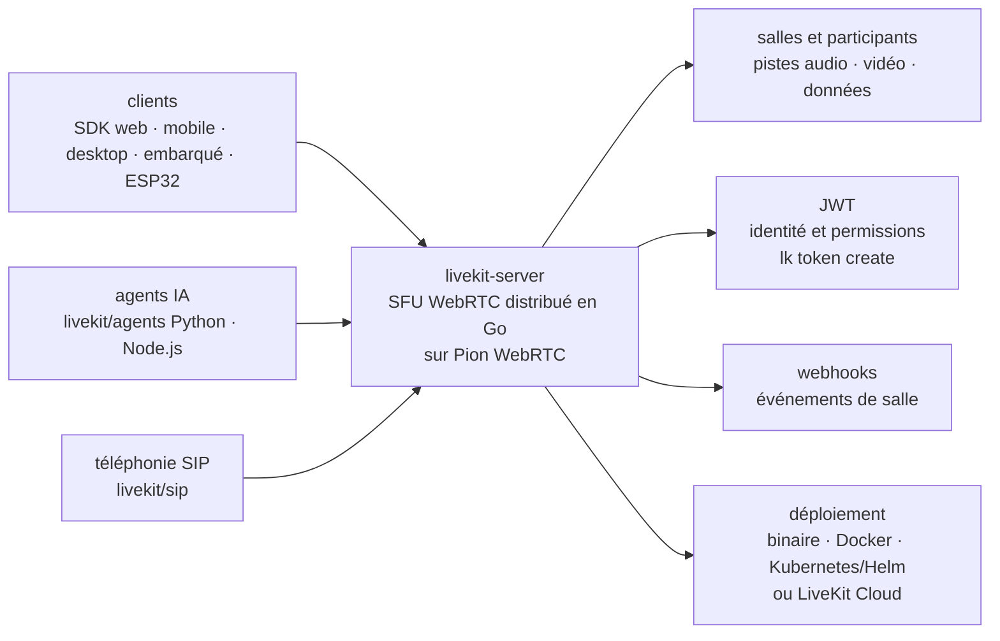

# livekit/livekit

> **Le serveur WebRTC qui met humains, appareils et agents IA dans une même salle temps réel.**

## Le problème

Faire circuler de l'audio et de la vidéo en temps réel entre un navigateur, un téléphone et un
modèle demande de recoller soi-même signalisation, TURN, encodages, abonnements sélectifs et
montée en charge multi-régions — chantier d'infrastructure qui n'a rien à voir avec le produit.

## Ce que ça fait vraiment

LiveKit server est un SFU (Selective Forwarding Unit) WebRTC distribué écrit en Go, bâti sur
l'implémentation [Pion WebRTC](https://github.com/pion/webrtc). Il achemine pistes audio,
vidéo et données entre les participants d'une salle, sans réencoder ni mixer.

Il traite les personnes, les appareils et les agents IA comme des participants du même type,
avec un mécanisme de *dispatch* pour faire entrer un agent automatiquement ou à la demande.
L'authentification se fait par jetons JWT encodant l'identité et les permissions de salle.

Côté réseau, il gère UDP/TCP/TURN, la simulcast, l'abonnement sélectif, la détection de
locuteur, les codecs SVC (VP9, AV1), le chiffrement de bout en bout, les *data tracks* basse
latence, les webhooks et le déploiement distribué multi-régions.

Il se déploie en binaire unique, en Docker ou en Kubernetes (images officielles et charts Helm
publiés). La téléphonie (SIP), l'enregistrement (Egress) et l'ingestion (Ingress) sont des
services **séparés** du même écosystème, pas des fonctions de ce dépôt.

## Comment c'est branché

Aucun diagramme tiré du code n'existe pour ce dépôt : ce schéma est reconstruit depuis le seul
README, et n'utilise donc pas de vrais noms de fichiers.



## Essayer

```bash
brew install livekit
```

```bash
curl -sSL https://get.livekit.io | bash
```

Puis, commandes copiées du README, dans l'ordre : démarrer le serveur en mode développement
avec `livekit-server --dev` (clé `devkey`, secret `secret`), créer un jeton, rejoindre la salle
avec un publieur de test.

```bash
lk token create \
    --api-key devkey --api-secret secret \
    --join --room my-first-room --identity user1 \
    --valid-for 24h

lk room join \
    --url ws://localhost:7880 \
    --api-key devkey --api-secret secret \
    --identity bot-user1 \
    --publish-demo \
    my-first-room
```

Depuis les sources (prérequis annoncés : Go 1.26+ et `GOPATH/bin` dans le `PATH`) :

```bash
git clone https://github.com/livekit/livekit
cd livekit
./bootstrap.sh
mage
```

## Coût et pièges

- **Le serveur est gratuit** et sous Apache 2.0 : pas de clé d'API à payer pour l'auto-héberger.
  Les clés `devkey`/`secret` du mode `--dev` sont des valeurs de remplacement — le README renvoie
  à la documentation de déploiement pour la production.
- **Le chemin par défaut du README est LiveKit Cloud** : 19+ régions, 99,99 % d'uptime annoncés,
  plan Build gratuit sans carte bancaire, mais l'hébergement d'agents, l'inférence de modèles,
  la téléphonie et l'observabilité y sont ajoutés *par-dessus* le serveur. C'est la raison de
  l'alerte : les fonctions les plus visibles de la démo (LiveKit Inference, « pas de clé d'API
  par fournisseur ») sont des fonctions du SaaS, pas du dépôt.
- **Sans Cloud, les clés reviennent** : le README dit explicitement qu'en auto-hébergement il
  faut utiliser les *model plugins* à la place de LiveKit Inference — donc une clé par
  fournisseur STT/LLM/TTS, à ta charge.
- **Outillage séparé** : le README recommande d'installer `livekit-cli` à côté du serveur ; sans
  lui, pas de `lk token create` ni de trafic de test.
- **CPU et bande passante**, pas GPU : un SFU relaie des flux. Le README ne documente aucun
  chiffre de dimensionnement (RAM, cœurs, débit par salle).
- **Le TURN et le multi-régions sont des sujets d'exploitation** à part entière, renvoyés à la
  documentation d'auto-hébergement distribué.

## Ce que ce n'est pas

- **Ce n'est pas un framework d'agents vocaux.** Le README oriente d'emblée vers
  `livekit/agents` (Python et Node.js) pour STT/LLM/TTS, détection de tour de parole et appels
  d'outils. Ce dépôt transporte les médias ; il ne fait ni transcription ni synthèse.
- **Ce n'est pas une application de visioconférence** : LiveKit Meet, l'audio spatial et le
  livestream OBS sont des exemples hébergés dans `livekit-examples`, à déployer soi-même.
- **Ce n'est pas un produit complet une fois lancé** : enregistrement (Egress), ingestion
  (Ingress) et SIP sont des dépôts et des processus distincts à opérer en plus.

## Alternatives

| | Quand le préférer |
|---|---|
| **pion/webrtc** | Nommée dans le README : c'est la brique WebRTC en Go *sur laquelle* LiveKit est bâti. À préférer si tu écris ta propre topologie média et ne veux pas d'un serveur de salles imposé ; LiveKit si tu veux salles, JWT, simulcast et dispatch déjà câblés. |
| **livekit/agents** | Nommée dans le README, complémentaire plus que concurrente : c'est elle qu'on prend pour écrire l'agent vocal lui-même. Ce dépôt-ci ne sert que si tu héberges le transport. |
| **TEN-framework/ten-framework** et **GetStream/Vision-Agents** | Voisins du catalogue, non cités par le README : cadres d'agents temps réel, donc comparables à `livekit/agents`, pas à ce serveur. |

## Pour toi

À adopter dès qu'un projet IA doit parler et écouter en temps réel : c'est le transport de
référence sous les agents vocaux, avec une porte de sortie de l'auto-hébergement (Apache 2.0,
binaire unique) que peu de concurrents offrent. À ne pas installer si tu ne fais qu'écrire des
agents — prends `livekit/agents` et laisse le serveur à LiveKit Cloud le temps du prototype.
