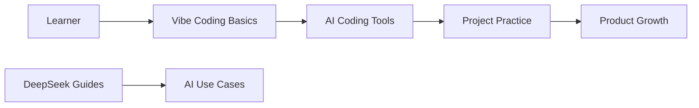

# liyupi/ai-guide

> Base de connaissances chinoise gratuite sur les outils d'IA et le Vibe Coding, pour débutants.

## Le problème
Les non-développeurs veulent utiliser l'IA pour coder et lancer un produit mais manquent de repères en chinois.

## Ce que ça fait vraiment
Tutoriel « Vibe Coding » (outils, projets, astuces, monétisation, ressources), pages sur DeepSeek (déploiement local, prompts), tests d'outils (Cursor, Claude Code, Gemini), scénarios d'usage. Le dépôt est un site VuePress ; le texte est en chinois, avec traductions en anglais et chinois traditionnel signalées.

## Comment c'est branché

## Essayer
Aucune commande documentée dans le README : lecture en ligne sur https://ai.codefather.cn/vibe.

## Coût et pièges
Gratuit ; un cours vidéo associé existe (promotion). Contenu sous CC BY-NC-SA 4.0 : usage commercial interdit sans autorisation écrite de l'auteur.

## Ce que ce n'est pas
Pas un outil ni du code : un site de contenu éditorial, rédigé par une personne, au ton promotionnel.

## Alternatives
Aucune alternative nommée dans le README.

## Pour toi
À ignorer : contenu d'initiation en chinois, orienté débutants et monétisation, peu utile à un profil data/IA/MLOps.

