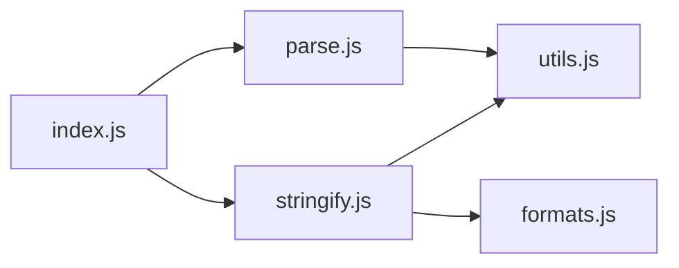

# ljharb/qs

> Bibliothèque JavaScript d'analyse et de génération de chaînes de requête, avec limites de sécurité.

## Le problème
Les query strings imbriquées (`a[b][c]=d`) et les entrées hostiles (profondeur énorme, `a[999999999]`) sont mal gérées par un parsing naïf.

## Ce que ça fait vraiment
`qs.parse` produit des objets et tableaux imbriqués, avec limites par défaut : profondeur 5, 1000 paramètres, tableaux de 20 éléments, et options pour lever des erreurs (`throwOnLimitExceeded`, `strictDepth`). `qs.stringify` supporte formats de tableaux, notation à points, encodeurs, charset iso-8859-1, RFC1738/3986.

## Comment c'est branché


## Essayer
```javascript
var qs = require('qs');
var obj = qs.parse('a=c');
var str = qs.stringify(obj);
```

## Coût et pièges
Gratuit. Depuis v6.14.1 et v6.15.2, l'analyse des crochets déséquilibrés change. Les limites ne bornent pas la taille totale : borner aussi le corps HTTP.

## Ce que ce n'est pas
Pas une défense complète contre les entrées hostiles. Les valeurs restent des chaînes (pas de conversion en nombres).

## Alternatives
- query-types : middleware Express cité par le README pour convertir les types.
- qs-iconv : pour d'autres jeux de caractères (Shift JIS).

## Pour toi
À adopter côté API Node : BSD-3-Clause, maintenu, limites utiles ; règle explicitement `depth` et `parameterLimit` pour les entrées publiques.

