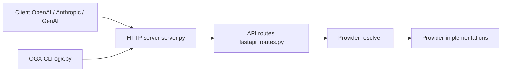

# llamastack/llama-stack

> Serveur d'API agentique compatible OpenAI (rebaptisé OGX) pour brancher n'importe quel modèle ou infrastructure.

## Le problème
Changer de modèle ou de fournisseur oblige à réécrire le code client.

## Ce que ça fait vraiment
Expose `/v1/chat/completions`, embeddings, Responses API (outils, MCP, recherche de fichiers), vector stores, batches et skills. Accepte aussi les SDK Anthropic et Google GenAI. Des providers pluggables (Ollama, vLLM, services gérés) se choisissent par configuration.

## Comment c'est branché


## Essayer
```bash
curl -LsSf https://github.com/ogx-ai/ogx/raw/main/scripts/install.sh | bash
uv pip install ogx
uv run ogx go
```

## Coût et pièges
Les modèles réels viennent d'un provider (Ollama, vLLM ou service payant) : clé d'API ou GPU à ta charge. Le dépôt a changé de nom : l'ancien nom et le nouveau coexistent.

## Ce que ce n'est pas
Ce n'est pas un modèle ni un runtime d'inférence : c'est une couche d'API au-dessus des providers.

## Alternatives
Aucune alternative nommée dans le README.

## Pour toi
À surveiller : pertinent pour uniformiser l'accès LLM d'une équipe MLOps ; le renommage en OGX impose de vérifier la stabilité avant adoption.

