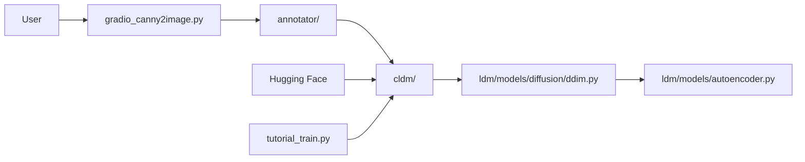

# lllyasviel/ControlNet

> Implémentation officielle de ControlNet 1.0 pour conditionner Stable Diffusion 1.5, destinée aux chercheurs.

## Le problème
Un prompt texte seul ne permet pas d'imposer une pose, des contours ou une profondeur à une image générée.

## Ce que ça fait vraiment
Copie « verrouillée » et copie « entraînable » des blocs de l'encodeur SD, reliées par des convolutions nulles : on ajoute un contrôle sans abîmer le modèle.
Neuf applis Gradio : Canny, M-LSD, HED, scribbles, pose, segmentation, profondeur, normales.
Annotateurs (`annotator/`) pour produire les cartes de conditionnement ; « guess mode » sans prompt.
Scripts d'entraînement sur vos propres paires (`tutorial_train.py`).

## Comment c'est branché


## Essayer
```bash
conda env create -f environment.yaml
conda activate control
python gradio_canny2image.py
```

## Coût et pièges
GPU requis ; poids SD et détecteurs à télécharger manuellement depuis Hugging Face. Dernier push en février 2024.

## Ce que ce n'est pas
Pas pour SDXL ni les modèles récents : cible SD 1.5. Pas une interface utilisateur soignée (Gradio, dessin hors UI). Le modèle anime n'est pas publié.

## Alternatives
- Mikubill A1111 WebUI Plugin : ControlNet intégré à WebUI, multi-ControlNet.
- ControlNet-for-Diffusers : portage vers diffusers.
- T2I-Adapter : modèle de contrôle plus petit.

## Pour toi
Valeur pédagogique (lire l'article et le code) ; en pratique, passe par diffusers.
