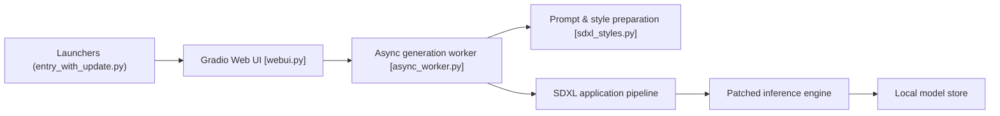

# lllyasviel/Fooocus

> Générateur d'images local basé sur SDXL et Gradio, pour produire des images en ne réglant presque que le prompt.

## Le problème
Les générateurs d'images en ligne sont payants et opaques ; les interfaces locales demandent beaucoup de réglages manuels.

## Ce que ça fait vraiment
Interface Gradio qui lance un worker asynchrone : texte vers image, variations et agrandissement, inpaint/outpaint, image prompt, description d'image. Un moteur GPT-2 local étend le prompt (style « Fooocus V2 »). Trois presets (défaut, réaliste, anime) et un moteur d'inférence patché (`ldm_patched`). Les modèles se téléchargent au premier lancement.

## Comment c'est branché


## Essayer
```bash
git clone https://github.com/lllyasviel/Fooocus.git
cd Fooocus
conda env create -f environment.yaml
conda activate fooocus
pip install -r requirements_versions.txt
python entry_with_update.py
python entry_with_update.py --preset anime
```

## Coût et pièges
GPU Nvidia de 4 Go de VRAM et 8 Go de RAM minimum, swap obligatoire ; 40 Go libres conseillés en cas d'erreur CPUAllocator. Le premier lancement télécharge plusieurs Go de modèles depuis Hugging Face. `--listen` et `--share` ouvrent l'interface sans authentification tant que tu n'ajoutes pas `auth.json`.

## Ce que ce n'est pas
Ce n'est pas adapté aux modèles récents : le README dit lui-même que ses astuces reposent sur SDXL et ne sont plus très à jour. Sur Mac ou AMD, le support est en bêta et beaucoup plus lent.

## Alternatives
- ComfyUI : graphe de nœuds, plus de contrôle mais plus de réglages.
- AUTOMATIC1111 (cité pour le reweighting) : écosystème plus large.
- mashb1t/Fooocus, RuinedFooocus : forks listés dans le README.

## Pour toi
À surveiller : bon terrain pour comprendre un pipeline SDXL local, mais GPL-3.0 et moteur centré SDXL ; ne pas en faire une brique durable.

