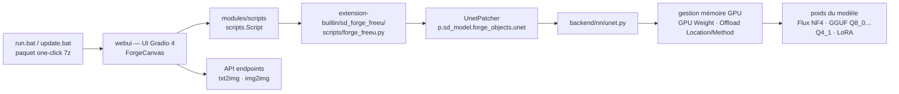

# lllyasviel/stable-diffusion-webui-forge

> **A Stable Diffusion WebUI variant focused on GPU memory control and quantised Flux models.**

## The problem

Running a recent diffusion model on a consumer card runs into memory: the full model does not
fit, and the upstream interface offers no explicit lever for deciding how much of the weights
stays on the GPU. Adding an experimental feature to Stable Diffusion WebUI also means hooking
into a codebase the README itself calls "almost static" today.

## What it actually does

Forge is a platform built **on top of** AUTOMATIC1111/stable-diffusion-webui (hence on Gradio),
which the README presents as aiming at four things: making development easier, optimising
resource management, speeding up inference and studying experimental features. The name comes
from "Minecraft Forge": it is the modding layer of the upstream project.

The base is SD-WebUI 1.10.1, at a commit named in the README, and the README states a resync
with upstream every 90 days, or on important fixes.

On the model side, the README announces native support for Flux in BitsandBytes NF4 and in
GGUF (Q8_0, Q5_0, Q5_1, Q4_0, Q4_1), with a "GPU Weight" slider, a Queue/Async Swap toggle and
a swap-location toggle. The NF4 and GGUF Q8_0/Q5_0/Q4_0 variants are listed as LoRA-capable.

The README also lists, as components tested one by one: ControlNets, preprocessors,
IP-Adapters, Instant-ID, reference-only methods, integrated extensions, a Gradio 4 canvas with
128-level Wacom pen pressure, LayerDiffuse for transparent image editing, and txt2img / img2img
API endpoints.

Finally, Forge exposes a `UnetPatcher`: the README prints `forge_freeu.py` in full, a
single-file extension that clones the patcher, attaches a `set_model_output_block_patch` to it
and declares its own Gradio UI — the extension pattern the project puts forward.

## How it is wired



No code-derived diagram exists for this repository: the graph above is reconstructed from the
README alone. The names `extension-builtin/sd_forge_freeu/scripts/forge_freeu.py` and
`backend/nn/unet.py` come from the README; the other nodes are components it names without
giving a file path.

## Trying it

The README's nominal path is an archive to unpack, not a command:

```
1. Download webui_forge_cu121_torch231.7z (CUDA 12.1 + Pytorch 2.3.1, "Recommended")
2. Uncompress
3. update.bat
4. run.bat
```

The README insists: skipping `update.bat` leaves you on an earlier version with unfixed bugs.
Two other packages are offered: CUDA 12.4 + Pytorch 2.4 (announced as fastest, but MSVC may be
broken and xformers may not work) and CUDA 12.1 + Pytorch 2.1 (the older environment).

For an "advanced" install, the README points at the classic clone, without further detail:

```bash
git clone https://github.com/lllyasviel/stable-diffusion-webui-forge.git
# then run webui-user.bat (same method as SD-WebUI)
```

## Cost and pitfalls

- **NVIDIA GPU implied**: every offered package is CUDA (12.1 or 12.4). The README documents no
  CPU path, no ROCm, no Apple Silicon. The VRAM requirement is not stated in figures — which is
  precisely what the "GPU Weight" slider is for.
- **"GPU Weight" is pitfall number one**: a discussion thread dedicated to Flux performance
  problems is summarised in the README as "DO NOT set GPU Weight too high! Lower GPU Weight
  solves 99% problems!".
- **Windows first**: `.7z`, `update.bat`, `run.bat`, `webui-user.bat`, and a component listed as
  "Microsoft Surface touch pressure". No Linux or macOS script is mentioned.
- **Broken components as of the README**: "Microsoft Surface touch pressure support" (broken),
  "OFT LoRAs" (broken), ControlNets Union and ControlNets Flux (not implemented yet). The API
  endpoints are marked "Normal, but pending improved Flux support".
- **Gradio 4 ergonomics**: the README opens its link list with a warning — you need the **right**
  mouse button to move the canvas.
- **AGPL-3.0 licence** (catalogue data): strong copyleft, with the network clause. To settle
  before hosting the interface for third parties.
- **Shifted extension ecosystem**: the README links an "Extension List and Extension Replacement
  List (Temporary)", meaning some SD-WebUI extensions must be swapped for a Forge variant.
- **Last column of the status table**: the manual tests are dated July to September 2024, and the
  README closes with "Under Construction — docs / UI / functionality may change with updates".

## What it is not

- **It is not an independent fork of SD-WebUI**: it is a platform sitting on top, tracking
  upstream and resyncing periodically. The base features come from there.
- **It is not a model**: Forge ships neither Flux, nor Stable Diffusion, nor any LoRA. Weights
  are downloaded and installed alongside, under their own licences.
- **It is not an image-generation API to put into service**: the endpoints exist, but the README
  marks them as awaiting better Flux support, and the project is declared under construction.
- **It is not automatic memory savings**: the README describes settings you tune yourself (GPU
  Weight, Offload Location, Offload Method, Queue/Async Swap). Set wrong, they degrade
  performance rather than improve it.
- **It is not a team project**: the README speaks in the first person ("I will take a look every
  several days").

## Alternatives

| | When to pick it instead |
|---|---|
| **AUTOMATIC1111/stable-diffusion-webui** | Named in the README as the project Forge is a platform on top of. Pick it when you want the reference base, its extension ecosystem untouched and no experimental layer above; pick Forge for quantised Flux and the GPU memory levers. |
| **gradio-app/gradio** | Named in the README as the interface building block. Not a functional alternative, but the dependency that explains the UI breaks (Gradio 4, right-click to move the canvas). |

The catalogue neighbours (`mudler/LocalAI`, `LearningCircuit/local-deep-research`,
`Osmantic/ODS`, `beclab/Olares`) are not comparable: language-model servers, a research agent
and a self-hosting platform, none of which provides a diffusion image-generation interface.

## For you

Interesting on two counts, and worth watching rather than adopting: it is the shortest way to
fit quantised Flux (NF4, GGUF) on a consumer card with explicit control over weight placement,
and the `UnetPatcher` illustrated by `forge_freeu.py` is a readable pattern for patching a UNet
without forking the model. Rule it out as a production brick: single maintainer, broken
components listed in the README, a project declared under construction, AGPL-3.0, and a Windows
`.7z` install path that does not script into a CI pipeline.
