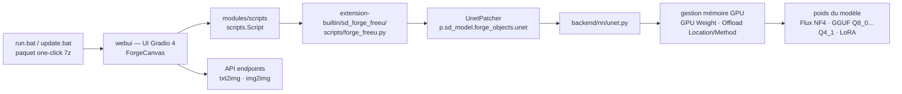

# lllyasviel/stable-diffusion-webui-forge

> **Une variante de Stable Diffusion WebUI axée sur la gestion mémoire GPU et les modèles Flux quantifiés.**

## Le problème

Faire tourner un modèle de diffusion récent sur une carte grand public bute sur la mémoire :
le modèle complet ne tient pas, et l'interface d'origine n'offre pas de levier explicite pour
décider quelle part des poids reste sur le GPU. Ajouter une fonctionnalité expérimentale à
Stable Diffusion WebUI demande par ailleurs de se brancher dans un socle que le README décrit
comme « presque statique » aujourd'hui.

## Ce que ça fait vraiment

Forge est une plateforme construite **par-dessus** AUTOMATIC1111/stable-diffusion-webui (donc
sur Gradio), présentée par le README comme visant quatre choses : faciliter le développement,
optimiser la gestion des ressources, accélérer l'inférence et servir de terrain d'essai à des
fonctionnalités expérimentales. Le nom vient de « Minecraft Forge » : c'est la couche de
modding du projet amont.

Le socle est SD-WebUI 1.10.1, à un commit nommé dans le README, et le README annonce une
resynchronisation avec l'amont tous les 90 jours ou lors de correctifs importants.

Côté modèles, le README annonce une prise en charge native de Flux en BitsandBytes NF4 et en
GGUF (Q8_0, Q5_0, Q5_1, Q4_0, Q4_1), avec un curseur « GPU Weight », un basculement
Queue/Async Swap et un choix d'emplacement d'offload. Les variantes NF4 et GGUF Q8_0/Q5_0/Q4_0
sont annoncées comme compatibles LoRA.

Le README intègre aussi, en les listant comme composants testés un par un : ControlNets,
préprocesseurs, IP-Adapters, Instant-ID, méthodes reference-only, extensions intégrées, un
canevas Gradio 4 avec pression de stylet Wacom 128 niveaux, LayerDiffuse pour l'édition
d'images transparentes, et des points d'API txt2img / img2img.

Enfin, Forge expose un `UnetPatcher` : le README montre en entier `forge_freeu.py`, une
extension d'un seul fichier qui clone le patcher, y accroche un `set_model_output_block_patch`
et déclare son UI Gradio — c'est le modèle d'extension que le projet met en avant.

## Comment c'est branché



Aucun diagramme tiré du code n'existe pour ce dépôt : ce schéma est reconstruit depuis le seul
README. Les noms `extension-builtin/sd_forge_freeu/scripts/forge_freeu.py` et
`backend/nn/unet.py` viennent du README ; le reste des nœuds reprend des composants qu'il
nomme sans en donner le chemin de fichier.

## Essayer

Le chemin nominal du README est un paquet à décompresser, pas une commande :

```
1. Télécharger webui_forge_cu121_torch231.7z (CUDA 12.1 + Pytorch 2.3.1, « Recommended »)
2. Décompresser
3. update.bat
4. run.bat
```

Le README insiste : ne pas lancer `update.bat` expose à une version antérieure avec des bugs
non corrigés. Deux autres paquets sont proposés : CUDA 12.4 + Pytorch 2.4 (annoncé le plus
rapide, mais MSVC peut être cassé et xformers peut ne pas fonctionner) et CUDA 12.1 +
Pytorch 2.1 (ancien environnement).

Pour une installation « avancée », le README renvoie au clonage classique, sans détailler
davantage :

```bash
git clone https://github.com/lllyasviel/stable-diffusion-webui-forge.git
# puis exécuter webui-user.bat (méthode identique à SD-WebUI)
```

## Coût et pièges

- **GPU NVIDIA implicite** : tous les paquets proposés sont CUDA (12.1 ou 12.4). Le README ne
  documente ni chemin CPU, ni ROCm, ni Apple Silicon. La quantité de VRAM requise n'est pas
  chiffrée — c'est justement le rôle du curseur « GPU Weight ».
- **« GPU Weight » est le piège numéro un** : un fil de discussion dédié aux problèmes de
  performance Flux est résumé dans le README par « DO NOT set GPU Weight too high ! Lower GPU
  Weight solves 99% problems ! ».
- **Windows d'abord** : `.7z`, `update.bat`, `run.bat`, `webui-user.bat`, et un composant
  listé « Microsoft Surface touch pressure ». Aucun script Linux ou macOS n'est mentionné.
- **Composants cassés à la date du README** : « Microsoft Surface touch pressure support »
  (cassé), « OFT LoRAs » (cassé), ControlNets Union et ControlNets Flux (non implémentés). Les
  points d'API sont notés « Normal, but pending improved Flux support ».
- **Ergonomie Gradio 4** : le README ouvre sa liste de liens par un avertissement — il faut le
  **bouton droit** de la souris pour déplacer le canevas.
- **Licence AGPL-3.0** (donnée du catalogue) : copyleft fort, avec la clause réseau. À
  arbitrer avant tout hébergement de l'interface pour des tiers.
- **Écosystème d'extensions décalé** : le README renvoie à une « Extension List and Extension
  Replacement List (Temporary) », c'est-à-dire que des extensions SD-WebUI doivent être
  remplacées par une variante Forge.
- **Dernière colonne du tableau d'état** : les tests manuels y sont datés de juillet à
  septembre 2024, et le README se termine par « Under Construction — docs / UI / functionality
  may change with updates ».

## Ce que ce n'est pas

- **Ce n'est pas un fork indépendant de SD-WebUI** : c'est une plateforme posée dessus, qui
  suit l'amont et se resynchronise périodiquement. Les fonctionnalités de base viennent de là.
- **Ce n'est pas un modèle** : Forge n'embarque ni Flux, ni Stable Diffusion, ni LoRA. Les
  poids se téléchargent et s'installent à côté, et leurs propres licences s'appliquent.
- **Ce n'est pas une API de génération d'images à mettre en service** : les points d'API
  existent mais le README les donne en attente d'un meilleur support de Flux, et le projet est
  déclaré en construction.
- **Ce n'est pas un gain de mémoire automatique** : le README décrit des réglages à régler
  soi-même (GPU Weight, Offload Location, Offload Method, Queue/Async Swap). Mal réglés, ils
  dégradent les performances plutôt qu'ils ne les améliorent.
- **Ce n'est pas un projet d'équipe** : le README parle à la première personne (« I will take
  a look every several days »).

## Alternatives

| | Quand le préférer |
|---|---|
| **AUTOMATIC1111/stable-diffusion-webui** | Nommé dans le README comme le projet dont Forge est la plateforme. À préférer quand on veut le socle de référence, son écosystème d'extensions intact et pas de couche expérimentale par-dessus ; Forge à préférer pour Flux quantifié et les leviers de mémoire GPU. |
| **gradio-app/gradio** | Nommé dans le README comme la brique d'interface. Ce n'est pas une alternative fonctionnelle, mais la dépendance qui explique les ruptures d'ergonomie (Gradio 4, clic droit pour le canevas). |

Les voisins proposés par le catalogue (`mudler/LocalAI`,
`LearningCircuit/local-deep-research`, `Osmantic/ODS`, `beclab/Olares`) ne sont pas comparables :
ce sont des serveurs de modèles de langage, un agent de recherche et une plateforme
d'auto-hébergement, aucun ne fournit d'interface de génération d'images par diffusion.

## Pour toi

Intéressant à deux titres et à surveiller plutôt qu'à adopter : c'est le moyen le plus court de
faire tenir Flux quantifié (NF4, GGUF) sur une carte grand public avec un contrôle explicite du
placement des poids, et l'`UnetPatcher` illustré par `forge_freeu.py` est un patron lisible pour
patcher un UNet sans forker le modèle. À écarter comme brique de production : mainteneur unique,
composants cassés listés dans le README, projet déclaré en construction, AGPL-3.0 et un chemin
d'installation Windows par paquet `.7z` qui ne se scripte pas dans une chaîne CI.
