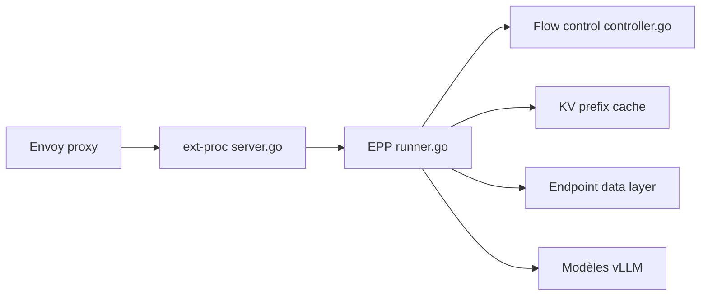

# llm-d/llm-d-router

> Routeur d'inférence Kubernetes qui place les requêtes LLM selon la charge et le cache KV.

## Le problème
Répartir le trafic entre réplicas de modèles sans tenir compte du cache de préfixes et de la charge gaspille du GPU.

## Ce que ça fait vraiment
L'Endpoint Picker (EPP) évalue chaque requête contre l'état de l'InferencePool (localité du cache KV, charge, priorité) et choisit l'endpoint, via le protocole ext-proc d'Envoy. Ajoute les API InferenceObjective et InferenceModelRewrite, un contrôle de flux, un sidecar de désagrégation P/D et E/P/D. Deux modes : standalone (Helm, Envoy) ou Gateway API.

## Comment c'est branché

## Essayer
Aucune commande documentée dans le README (renvoi vers le chart Helm, `config/charts/README.md`).

## Coût et pièges
Suppose un cluster Kubernetes, des serveurs de modèles et des GPU. Seul le mode `FULL_DUPLEX_STREAMED` d'Envoy est supporté. 334 issues ouvertes.

## Ce que ce n'est pas
Pas un serveur d'inférence : il route vers les serveurs existants. « Inference Scheduler » est l'ancien nom.

## Alternatives
- Gateway API Inference Extension : héberge désormais l'API InferencePool.

## Pour toi
À surveiller : utile si tu opères du serving LLM multi-réplicas sur Kubernetes ; sinon trop d'infrastructure.

