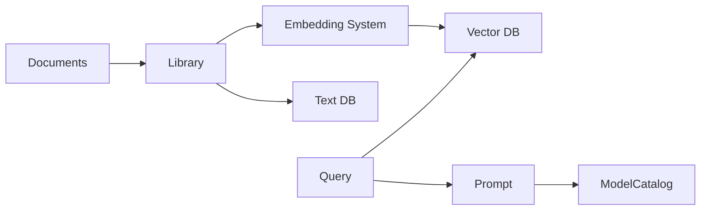

# llmware-ai/llmware

> Framework Python pour RAG local et privé, avec catalogue de petits modèles spécialisés.

## Le problème
Monter un RAG d'entreprise sur laptop ou edge oblige à assembler parsing, chunking, embeddings, base vectorielle et inférence quantifiée.

## Ce que ça fait vraiment
`ModelCatalog` : accès uniforme à 300+ modèles (GGUF, OpenVINO, ONNX, PyTorch), dont les séries maison BLING, DRAGON, SLIM.
`Library` : ingestion multi-format, chunking, embeddings installés sur Milvus, ChromaDB, PGVector, Qdrant, FAISS…
`Query` : recherche texte, sémantique, hybride, filtres ; `Prompt` avec sources et vérification de preuves.
`LLMfx` : agents à appels de fonction via modèles SLIM.

## Comment c'est branché


## Essayer
```bash
pip3 install llmware
git clone git@github.com:llmware-ai/llmware.git
sh ./welcome_to_llmware.sh
curl -o docker-compose.yaml https://raw.githubusercontent.com/llmware-ai/llmware/main/docker-compose.yaml
docker compose up -d
```

## Coût et pièges
Gratuit ; GGUF recommande au moins 16 Go de RAM. Mongo/Milvus/Postgres via Docker pour passer à l'échelle.

## Ce que ce n'est pas
Pas un orchestrateur généraliste : il pousse ses propres modèles. Les modèles cloud (OpenAI, Anthropic) restent à ta charge.

## Alternatives
Aucune alternative nommée dans le README.

## Pour toi
À surveiller : intéressant pour du RAG sur CPU/NPU sans cloud, mais écosystème centré sur ses modèles maison, moins standard que les frameworks courants.
