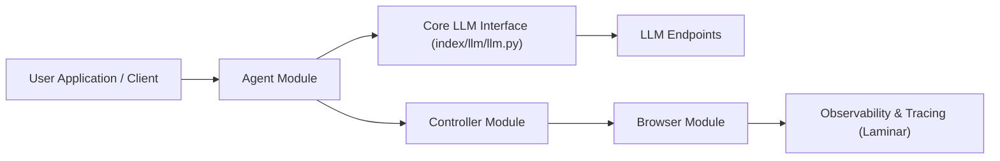

# lmnr-ai/index

> Agent navigateur Python qui exécute des tâches web avec un LLM à vision, en bibliothèque, CLI ou API.

## Le problème
Automatiser un site sans API : cliquer, saisir et extraire des données en langage naturel.

## Ce que ça fait vraiment
L'`Agent` demande au LLM (Gemini, Claude, OpenAI) une action ; le contrôleur la traduit en commandes Playwright/CDP ; le module navigateur les exécute. Sortie structurée par schéma Pydantic, CLI interactive Textual, Chrome local possible. Traçage optionnel vers la plateforme Laminar, et API serverless hébergée.

## Comment c'est branché


## Essayer
```bash
pip install lmnr-index 'lmnr[all]'
playwright install chromium
index run
```

## Coût et pièges
Clés du fournisseur LLM à ta charge ; l'API serverless et l'observabilité passent par un compte Laminar. Archivé, dernier push en juin 2025. Les modèles cités (Gemini 2.5, Claude 3.7) sont datés.

## Ce que ce n'est pas
Pas maintenu : plus de correctifs attendus. « État de l'art » est l'affirmation du README, non vérifiée ici.

## Alternatives
Aucune alternative nommée dans le README.

## Pour toi
À ignorer comme dépendance : archivé, avec des modèles dépassés ; à lire seulement pour l'architecture agent/contrôleur/navigateur.
