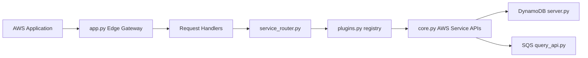

# localstack/localstack

> Émulateur local de services AWS dans un conteneur, pour développer et tester sans compte cloud.

## Le problème
Tester une appli AWS (Lambda, S3, DynamoDB, SQS) contre le vrai cloud coûte, est lent et nécessite des comptes et des droits.

## Ce que ça fait vraiment
Un conteneur unique reçoit les requêtes AWS de ton SDK ou de `awslocal` sur une passerelle (`app.py`), les analyse et les route (`service_router.py`) vers un service émulé enregistré comme plugin (`plugins.py`), qui renvoie une réponse sérialisée comme AWS.
Services cités : Lambda, S3, DynamoDB, Kinesis, SQS, SNS, CloudFormation, Step Functions, OpenSearch, DNS, certificats. Pilotage par le CLI `localstack` (start, status) ; Docker, Compose ou Helm.

## Comment c'est branché


## Essayer
```bash
brew install localstack/tap/localstack-cli
python3 -m pip install localstack
localstack start -d
localstack status services
awslocal sqs create-queue --queue-name sample-queue
```

## Coût et pièges
Docker requis ; ne pas lancer en root. La suite passe par l'image unifiée, gratuite en plan Hobby pour un usage non commercial ; la version Pro ajoute des API.

## Ce que ce n'est pas
Ce dépôt est archivé et en lecture seule : ce n'est plus là que vit LocalStack. Pas une couverture AWS complète : la liste des API prises en charge est à consulter.

## Alternatives
- LocalStack for AWS (image unifiée) — la suite officielle du projet, plan Hobby gratuit hors usage commercial.

## Pour toi
À ignorer ici ; pour émuler S3 ou SQS dans tes tests MLOps, regarde l'image unifiée et ses conditions.
