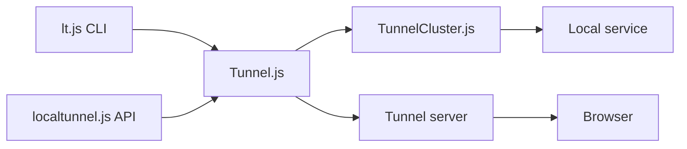

# localtunnel/localtunnel

> Expose un serveur local sur une URL publique, pour tester ou recevoir des callbacks.

## Le problème
Pour montrer un site local ou recevoir le webhook d'une API (ex. Twilio), il faut une URL publique sans toucher au DNS ni déployer.

## Ce que ça fait vraiment
Le client Node demande un tunnel au serveur distant (par défaut localtunnel.me), ouvre des connexions de transfert et relaie le trafic vers le port local. Sous-domaine demandable (non garanti), HTTPS local, réécriture du Host. Utilisable en CLI (`lt`) ou en API avec événements request/error/close.

## Comment c'est branché


## Essayer
```bash
npx localtunnel --port 8000
npm install -g localtunnel
lt --port 8000
```

## Coût et pièges
Gratuit, mais dépend du serveur public par défaut ; dernier push en août 2025, 167 issues ouvertes. Une URL publique expose ton service local à qui la connaît.

## Ce que ce n'est pas
Pas un serveur : celui-ci est un dépôt séparé (localtunnel/server). Le sous-domaine demandé peut ne pas être attribué.

## Alternatives
Clients dans d'autres langages cités : gotunnelme, go-localtunnel, localtunnel-client (.NET), rlt (Rust).

## Pour toi
Pratique pour exposer un notebook ou une API de démo une heure ; peu de garanties de disponibilité, à ne pas mettre dans un flux MLOps.

