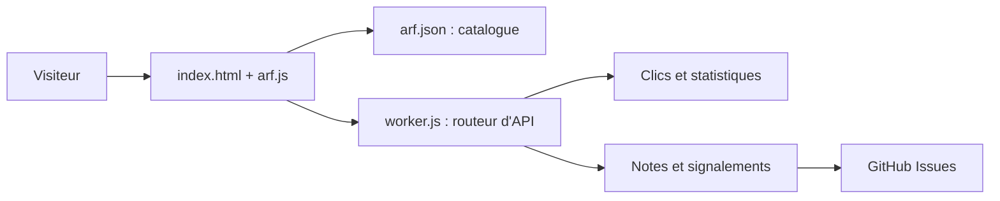

# lockfale/OSINT-Framework

> Annuaire web des outils OSINT gratuits, classés par catégorie, pour la recherche d'informations.

## Le problème
Les ressources de renseignement en sources ouvertes sont dispersées, et on ignore lesquelles sont gratuites.

## Ce que ça fait vraiment
Un arbre de ressources (`arf.json`) affiché sur osintframework.com, avec marqueurs : (T) outil local, (D) Google Dork, (R) inscription, (M) URL à éditer. Chaque entrée peut porter des métadonnées (statut, tarif, entrée, sortie, discrétion passive/active). Un Worker Cloudflare enregistre clics, notes et signalements, et peut créer des issues GitHub.

## Comment c'est branché

## Essayer
Aucune commande d'installation : ouvrir https://osintframework.com. Pour contribuer, ajouter une entrée dans `arf.json` puis ouvrir une PR.

## Coût et pièges
Gratuit ; certains sites listés demandent une inscription ou sont payants au-delà d'un seuil. Le site collecte clics et notes via un Worker.

## Ce que ce n'est pas
Ce n'est pas un outil d'enquête : c'est un répertoire de liens, dont la fraîcheur dépend des statuts renseignés.

## Alternatives
- Aucune alternative nommée dans le README.

## Pour toi
À surveiller : bon point d'entrée pour trouver des sources de données ouvertes, mais ce n'est qu'un annuaire de liens.

