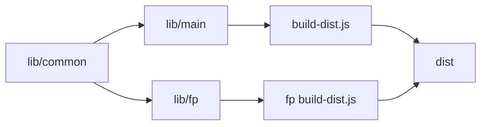

# lodash/lodash

> Bibliothèque JavaScript d'utilitaires pour tableaux, objets et fonctions, à usage de développeurs front ou Node.

## Le problème
Manipuler tableaux, objets, chaînes et fonctions en JavaScript demande beaucoup de code répétitif.

## Ce que ça fait vraiment
Lodash offre des méthodes modulaires (itération, test de valeurs, composition de fonctions) en plusieurs versions : complète (~24 kB compressé), noyau (~4 kB), FP (fonctions curryfiées), `lodash-es` et AMD. Le dépôt construit ces variantes via `lodash-cli`. Le README annonce un passage à la maturité « feature-complete » sous l'OpenJS Foundation, avec un comité technique en cours de refonte.

## Comment c'est branché


## Essayer
```bash
npm i --save lodash
```
```js
var _ = require('lodash');
var fp = require('lodash/fp');
var at = require('lodash/at');
```

## Coût et pièges
Gratuit. Licence présente mais non identifiée par GitHub ; le README dit MIT. Versions incohérentes entre le README (4.18.1) et l'analyse d'architecture (4.17.21) : à vérifier.

## Ce que ce n'est pas
Ce n'est pas une bibliothèque de calcul de données : c'est du JavaScript généraliste.

## Alternatives
Aucune alternative nommée dans le README.

## Pour toi
Ignorer : outil JavaScript généraliste, hors de la pile Python de données et d'IA.

