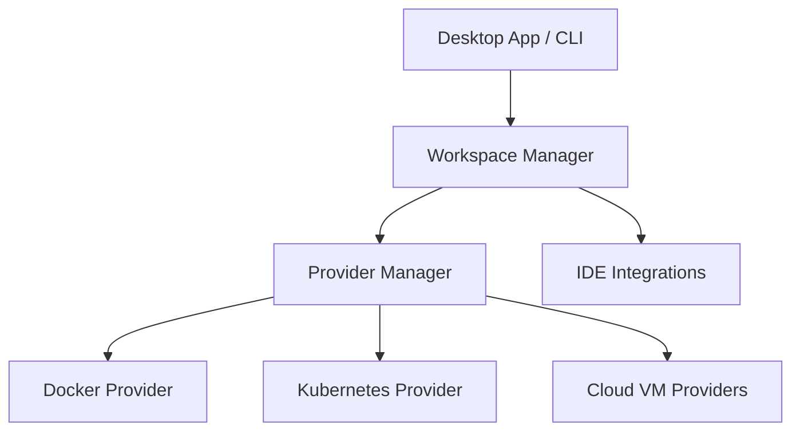

# loft-sh/devpod

> Environnements de dev reproductibles à partir d'un devcontainer, sur n'importe quel backend, sans serveur.

## Le problème
Codespaces et les services équivalents coûtent cher et t'enferment chez un fournisseur. Monter à la main des VM de développement prend du temps.

## Ce que ça fait vraiment
Il réutilise le standard DevContainer et crée l'environnement en local (Docker), sur Kubernetes ou sur une VM cloud.
Le tout fonctionne côté client uniquement : les VM inactives s'éteignent automatiquement, avec synchronisation des identifiants Git et Docker et des prebuilds.
Il prend en charge VSCode, JetBrains et SSH, avec une application de bureau et une CLI.
Les fournisseurs sont extensibles, et on peut écrire les siens.

## Comment c'est branché

## Essayer
Le README ne donne aucune commande : seulement des liens vers l'application de bureau (macOS, Windows, AppImage).

## Coût et pièges
L'outil est gratuit. Les VM cloud sont facturées par ton fournisseur.

## Ce que ce n'est pas
Ce n'est pas un service hébergé. Le README est court et le diagramme est générique. Dernier push le 2025-11-14.

## Alternatives
Le README cite GitHub Codespaces, JetBrains Spaces et Google Cloud Workstations comme services hébergés comparables, mais pas de dépôts.

## Pour toi
À surveiller : pratique pour lancer à la demande des environnements GPU jetables avec un devcontainer, mais l'activité ralentit.
