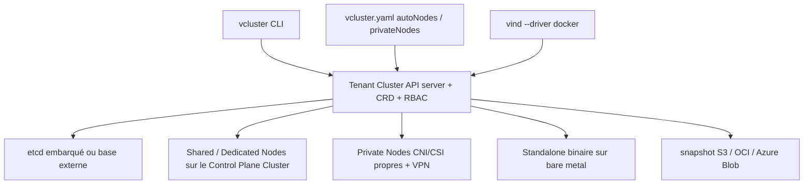

# loft-sh/vcluster

> Clusters Kubernetes virtuels isolés, avec leur propre API server, pour plateformes multi-locataires et GPU.

## Le problème
Isoler des équipes par namespace laisse un plan de contrôle partagé : pas de CRD propres, pas de RBAC propre, chemins latéraux possibles.
Donner un vrai cluster par équipe multiplie l'infrastructure et le coût.

## Ce que ça fait vraiment
Crée des Tenant Clusters : chacun a son API server, ses CRD, son RBAC et son datastore (etcd embarqué ou base externe PostgreSQL/MySQL/RDS).
Quatre architectures : Shared Nodes (densité), Dedicated Nodes (pools de nœuds étiquetés), Private Nodes v0.27+ (CNI/CSI propres, adhésion par jeton, VPN chiffré v0.30+), Standalone v0.29+ (binaire autonome, sans cluster de contrôle).
Auto Nodes v0.28+ provisionne les nœuds privés via Karpenter ; vind v0.32+ fait tourner un cluster complet dans Docker.
Snapshot et restauration vers S3, OCI, Azure Blob ou stockage local ; DRA pour les GPU ; sync bidirectionnelle des ressources en modes Shared/Dedicated.

## Comment c'est branché


## Essayer
```bash
brew install loft-sh/tap/vcluster
vcluster create my-vcluster --namespace team-x
kubectl get namespaces
vcluster create my-vcluster --driver docker
```

## Coût et pièges
Ce dépôt est le moteur ouvert ; sleep mode, VPN de nœuds, UI et les types Slurm/Ray/Run:ai/inférence passent par vCluster Platform. Un palier gratuit est annoncé jusqu'à 64 CPU et 32 GPU.
Piège de cadrage : les fonctions de sync et de réutilisation de la pile plateforme ne valent qu'en modes Shared et Dedicated, pas en Private Nodes ni Standalone.

## Ce que ce n'est pas
Pas un namespace avec des règles par-dessus : le README insiste sur l'API server dédié.
Pas une distribution unique : le comportement change beaucoup selon l'architecture choisie.
Pas l'ensemble du produit — vNode, vMetal et l'intégration Netris sont d'autres briques payantes.

## Alternatives
Aucune alternative nommée ; les projets cités (Karpenter, kind, Argo, Crossplane) sont des composants ou des intégrations.

## Pour toi
Pertinent si tu dois découper un parc GPU entre équipes ; sinon un namespace bien réglé suffit.
