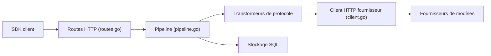

# looplj/axonhub

> Passerelle IA qui traduit les requêtes de n'importe quel SDK vers n'importe quel fournisseur, avec console d'administration.

## Le problème
Changer de fournisseur LLM oblige à changer de SDK et de code ; le suivi des coûts et des requêtes est dispersé.

## Ce que ça fait vraiment
Un serveur reçoit des requêtes OpenAI, Anthropic ou Gemini, les convertit vers le fournisseur configuré, route entre canaux avec reprise et basculement (<100 ms annoncé), et renvoie le résultat. Console web : canaux, modèles, clés API, RBAC et quotas, traçage, coût par requête (entrée, sortie, cache), analyses, playground. Gère texte, image, rerank, embeddings ; le temps réel reste à faire.

## Comment c'est branché


## Essayer
```python
from openai import OpenAI
client = OpenAI(base_url="http://localhost:8090/v1", api_key="your-axonhub-api-key")
# Déploiement : le README demande à un agent de suivre la skill `deploy-axonhub`.
```

## Coût et pièges
Clés fournisseurs à ta charge. Le déploiement passe par une skill d'agent, pas une commande documentée. Le README contient beaucoup de bandeaux de sponsors de revendeurs d'API ; compte de démo public à ne pas utiliser avec des données réelles. Licence présente mais non identifiée.

## Ce que ce n'est pas
Pas un fournisseur de modèles ni un revendeur. Les sponsors mentionnés sont des tiers, hors projet.

## Alternatives
Non documenté dans le README : aucune alternative nommée (musistudio/llms est cité comme inspiration).

## Pour toi
Utile si tu veux une passerelle LLM unique avec quotas et suivi de coût pour une équipe ; lis le fichier de licence avant tout usage commercial.

