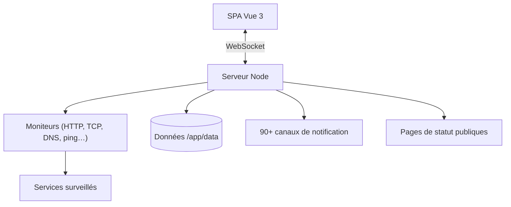

# louislam/uptime-kuma

> Supervision de disponibilité auto-hébergée, alternative libre aux services de type Uptime Robot.

## Le problème
Savoir qu'un service est tombé suppose un tiers payant, ou un script cron artisanal sans historique.
Et il faut une page de statut présentable pour les utilisateurs.

## Ce que ça fait vraiment
Surveille HTTP(s), mot-clé HTTP, requête JSON, TCP, WebSocket, ping, enregistrement DNS, push,
serveurs de jeu Steam et conteneurs Docker, à des intervalles descendant à 20 secondes.
Notifie via Telegram, Discord, Gotify, Slack, Pushover, e-mail SMTP et plus de 90 services.
Pages de statut multiples, mappables sur des domaines dédiés ; infos de certificat, proxy, 2FA, multilingue.

## Comment c'est branché


## Essayer
```bash
mkdir uptime-kuma && cd uptime-kuma
curl -o compose.yaml https://raw.githubusercontent.com/louislam/uptime-kuma/master/compose.yaml
docker compose up -d
docker run -d --restart=always -p 3001:3001 -v uptime-kuma:/app/data --name uptime-kuma louislam/uptime-kuma:2
```

## Coût et pièges
Gratuit. Écoute par défaut sur toutes les interfaces en 3001 : restreindre à `127.0.0.1` derrière un proxy.
Les systèmes de fichiers réseau type NFS ne sont pas supportés pour le volume de données.

## Ce que ce n'est pas
Pas une plateforme d'observabilité : ni métriques applicatives, ni traces, ni logs.
Pas de supervision distribuée multi-sites — une seule instance sonde depuis un seul point.
FreeBSD, OpenBSD, NetBSD, Replit et Heroku ne sont pas supportés.

## Alternatives
Aucune nommée dans le README hors `statping`, cité comme non maintenu.

## Pour toi
Le moyen le plus rapide de surveiller des endpoints d'inférence et des jobs. À adopter.
