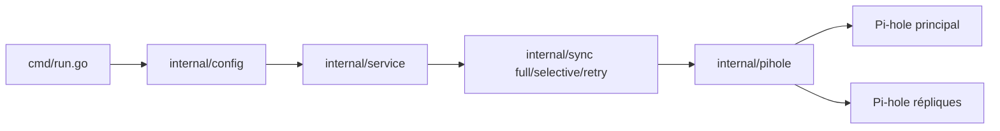

# lovelaze/nebula-sync

> Copie la configuration d'un Pi-hole v6 principal vers ses répliques, pour qui en exploite plusieurs.

## Le problème
Avec plusieurs Pi-hole, chaque réglage DNS, liste ou groupe doit être refait à la main sur chaque instance, et les serveurs dérivent.

## Ce que ça fait vraiment
Un exécutable Go (ou conteneur) lit `PRIMARY` et `REPLICAS` dans l'environnement, exporte la config du principal via l'API Pi-hole puis l'importe sur chaque réplique. Deux modes : synchro complète par Teleporter (`FULL_SYNC=true`) ou sélective, avec filtres include/exclude par section. Une planification cron est intégrée, avec webhooks de succès/échec. Projet non officiel, sans lien avec Pi-hole.

## Comment c'est branché


## Essayer
```bash
docker run --rm \
  --name nebula-sync \
  -e PRIMARY="http://ph1.example.com|password" \
  -e REPLICAS="http://ph2.example.com|password" \
  -e FULL_SYNC=true \
  -e RUN_GRAVITY=true \
  ghcr.io/lovelaze/nebula-sync:latest
```

## Coût et pièges
Gratuit ; il faut au moins deux Pi-hole v6 et leurs mots de passe en clair dans l'environnement (secrets Docker possibles). Le conteneur tourne en utilisateur 1001 : les fichiers de secrets doivent lui être lisibles. Avec des mots de passe d'application, activer `webserver.api.app_sudo` sur les répliques.

## Ce que ce n'est pas
Ce n'est pas un module officiel Pi-hole. Les filtres de config ne s'appliquent que si `FULL_SYNC=false`, et sont sensibles à la casse. Aucune haute disponibilité : c'est une copie de config, pas de la réplication en temps réel.

## Alternatives
Aucune alternative nommée dans le README.

## Pour toi
À ignorer : c'est de l'administration réseau domestique, sans rapport avec un travail data/IA/MLOps, sauf si tu opères toi-même plusieurs Pi-hole.
