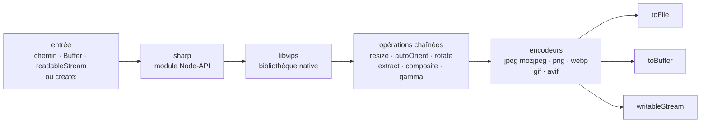

# lovell/sharp

> **Node-API module that converts and resizes images to JPEG, PNG, WebP, GIF and AVIF.**

## The problem

Producing web-sized thumbnails from large source images in JavaScript usually means shelling
out to ImageMagick or GraphicsMagick: you install the binary, manage the subprocess and absorb
its processing time. And a conversion done carelessly breaks colour spaces, ignores embedded
ICC profiles and silently flattens alpha transparency.

## What it actually does

sharp exposes a chained JavaScript API wrapping the native
[libvips](https://github.com/libvips/libvips) library. The stated use case is converting large
images in common formats into smaller, web-friendly images of varying dimensions: JPEG, PNG,
WebP, GIF and AVIF.

Beyond resizing, the README lists rotation, extraction, compositing and gamma correction.
Resampling uses Lanczos; colour spaces, embedded ICC profiles and alpha transparency channels
are, the README says, all handled correctly.

Input can be a file path, an in-memory buffer, a stream, or an image built from scratch
(`create:` with width, height, channel count and a background colour). Output goes to a file
(`toFile`), a buffer (`toBuffer`) or a stream — a bare `sharp()` object is itself a transform
stream, dropped between a `readableStream` and a `writableStream`.

The README claims resizing is typically 4x-5x faster than the quickest ImageMagick and
GraphicsMagick settings, and states that most modern macOS, Windows and Linux systems require
no additional install or runtime dependencies.

## How it is wired



No code-derived diagram exists for this repository: the graph is reconstructed from the README
alone. The node to keep in mind is `libvips` — sharp is a JavaScript layer over native code,
not an image-processing implementation written in JavaScript.

## Trying it

```sh
npm install sharp
```

```javascript
// ESM
import sharp from 'sharp';

// CJS
const sharp = require('sharp');
```

```javascript
await sharp(inputBuffer)
  .resize({ width: 320, height: 240 })
  .toFile('output.webp', (err, info) => { ... });
```

```javascript
const output = await sharp('input.jpg')
  .autoOrient()
  .resize({ width: 200 })
  .jpeg({ mozjpeg: true })
  .toBuffer();
```

And the streaming assembly, with rounded corners supplied by an in-memory SVG:

```javascript
const roundedCorners = Buffer.from(
  '<svg><rect x="0" y="0" width="200" height="200" rx="50" ry="50"/></svg>'
);

const roundedCornerResizer =
  sharp()
    .resize(200, 200)
    .composite([{
      input: roundedCorners,
      blend: 'dest-in'
    }])
    .png();

readableStream
  .pipe(roundedCornerResizer)
  .pipe(writableStream);
```

## Cost and traps

- **Free, under Apache-2.0** per the catalogue and the README's "Licensing" section
  ("Copyright 2013 Lovell Fuller and others"). No API key, no account, no third-party service.
- **Runtime constraint**: you need a JavaScript engine providing Node-API v9. The README names
  Node.js >= 20.9.0, Deno and Bun. Anything older is out of spec.
- **Native dependency**: sharp sits on libvips. The README says most modern macOS, Windows and
  Linux systems need no extra install — so not all of them. The remaining cases (less common
  architectures or libc variants, minimal container images) are not detailed here: the README
  points to an external install page.
- **The README is a summary.** Installation, API reference, benchmarks and changelog all live
  on sharp.pixelplumbing.com, outside the repository read. Anything not covered above is
  undocumented *here*.
- **The 4x-5x figure is the README's**, measured against ImageMagick and GraphicsMagick on
  resizing. It cannot be checked from the repository read, and says nothing about the other
  operations.
- **Governance**: a personal repository of Lovell Fuller, hence the single-maintainer flag,
  even though the README says "and others" and links a contributor guide.

## What it is not

- **It is not a command-line tool.** It is a module you import from JavaScript; no `sharp ...`
  command is documented in the README.
- **It is not an image engine written in JavaScript**: the work is done natively by libvips. You
  inherit its formats, its limits and its build — and the need for a compatible binary to exist
  for your platform.
- **It is not an image service or a CDN**: no cache, no resize-by-URL on the fly, no storage.
  Those layers still have to be written around it.
- **It is not an editor**: the README covers conversion, resizing, rotation, extraction,
  compositing and gamma. Nothing about content-aware work, creative filters or interactive
  editing.

## Alternatives

| | When to prefer it |
|---|---|
| **libvips/libvips** | Named in the README: it is the engine underneath sharp. Prefer it when working outside JavaScript, or when you need operations sharp's API does not expose. |
| **ImageMagick** | Cited in the README as the comparison point. Prefer it when you want a do-everything command-line tool and feature coverage matters more than throughput. |
| **GraphicsMagick** | Cited on the same footing. Same trade-off as ImageMagick: an external binary rather than a module inside the Node process. |

The catalogue neighbours (`zumerlab/snapdom`, `mrdoob/three.js`, `juliangarnier/anime`,
`Asabeneh/30-Days-Of-JavaScript`) are not comparable: they are grouped by language, but cover
DOM capture, in-browser 3D, animation and training — none does server-side image conversion.

## For you

Useful as soon as a data pipeline or a service touches images: preparing vision datasets (bulk
resizing, colour-space normalisation, EXIF reorientation via `autoOrient`), or generating
thumbnails in a Node service sitting in front of a model. The streaming API avoids loading whole
files into memory, which matters at volume. Skip it if the whole chain is Python: stay on Pillow
or libvips directly rather than adding a Node runtime.
