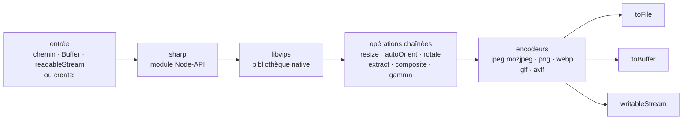

# lovell/sharp

> **Module Node-API qui convertit et redimensionne des images en JPEG, PNG, WebP, GIF et AVIF.**

## Le problème

Produire des vignettes web à partir de gros fichiers image depuis JavaScript passe
habituellement par un appel à ImageMagick ou GraphicsMagick en sous-processus : il faut
installer le binaire, gérer son cycle de vie et absorber son temps de traitement. Et une
conversion faite vite mal tenue casse les espaces colorimétriques, ignore les profils ICC
embarqués et aplatit la transparence alpha sans le dire.

## Ce que ça fait vraiment

sharp expose une API JavaScript chaînée qui enveloppe la bibliothèque native
[libvips](https://github.com/libvips/libvips). Le cas d'usage annoncé est la conversion de
grandes images vers des formats web plus petits et de dimensions variées : JPEG, PNG, WebP,
GIF, AVIF.

Au-delà du redimensionnement, le README cite la rotation, l'extraction, la composition et la
correction gamma. Le rééchantillonnage utilise Lanczos ; les espaces colorimétriques, les
profils ICC embarqués et les canaux alpha sont, dit le README, traités correctement.

L'entrée peut être un chemin de fichier, un tampon mémoire, un flux, ou une image créée de
toutes pièces (`create:` avec largeur, hauteur, nombre de canaux et couleur de fond). La
sortie va vers un fichier (`toFile`), un tampon (`toBuffer`) ou un flux — l'objet `sharp()`
sans argument est lui-même un flux transformateur, qu'on branche entre un `readableStream` et
un `writableStream`.

Le README annonce un redimensionnement 4 à 5 fois plus rapide que les réglages les plus
rapides d'ImageMagick et GraphicsMagick, et précise que la plupart des systèmes macOS,
Windows et Linux modernes n'exigent aucune dépendance d'installation ou d'exécution
supplémentaire.

## Comment c'est branché



Aucun diagramme tiré du code n'existe pour ce dépôt : ce schéma est reconstruit depuis le seul
README. Le point à retenir est le nœud `libvips` : sharp est une couche JavaScript sur du code
natif, et non une implémentation de traitement d'image en JavaScript.

## Essayer

```sh
npm install sharp
```

```javascript
// ESM
import sharp from 'sharp';

// CJS
const sharp = require('sharp');
```

```javascript
await sharp(inputBuffer)
  .resize({ width: 320, height: 240 })
  .toFile('output.webp', (err, info) => { ... });
```

```javascript
const output = await sharp('input.jpg')
  .autoOrient()
  .resize({ width: 200 })
  .jpeg({ mozjpeg: true })
  .toBuffer();
```

Et le montage en flux, avec des coins arrondis fournis par un SVG en mémoire :

```javascript
const roundedCorners = Buffer.from(
  '<svg><rect x="0" y="0" width="200" height="200" rx="50" ry="50"/></svg>'
);

const roundedCornerResizer =
  sharp()
    .resize(200, 200)
    .composite([{
      input: roundedCorners,
      blend: 'dest-in'
    }])
    .png();

readableStream
  .pipe(roundedCornerResizer)
  .pipe(writableStream);
```

## Coût et pièges

- **Gratuit, sous Apache-2.0** d'après le catalogue et la section « Licensing » du README
  (« Copyright 2013 Lovell Fuller and others »). Pas de clé d'API, pas de compte, pas de
  service tiers.
- **Contrainte d'exécution** : il faut un moteur JavaScript fournissant Node-API v9. Le README
  cite Node.js >= 20.9.0, Deno et Bun. Un runtime plus ancien est hors spécification.
- **Dépendance native** : sharp s'appuie sur libvips. Le README dit que la plupart des systèmes
  macOS, Windows et Linux modernes n'ont besoin d'aucune installation supplémentaire — donc pas
  tous. Les cas restants (architectures ou libc moins courantes, images de conteneur minimales)
  ne sont pas détaillés ici : le README renvoie à une page d'installation externe.
- **Le README est un résumé.** Installation, référence d'API, mesures de performance et
  journal des modifications vivent tous sur sharp.pixelplumbing.com, hors du dépôt lu. Ce qui
  n'est pas couvert ci-dessus est non documenté *ici*.
- **Le facteur 4x-5x est celui du README**, mesuré contre ImageMagick et GraphicsMagick sur le
  redimensionnement. Il n'est pas vérifiable depuis le dépôt lu et ne dit rien des autres
  opérations.
- **Gouvernance** : dépôt personnel de Lovell Fuller, d'où l'alerte « mainteneur unique », même
  si le README mentionne « and others » et renvoie à un guide de contribution.

## Ce que ce n'est pas

- **Ce n'est pas un outil en ligne de commande.** C'est un module qu'on importe depuis du code
  JavaScript ; aucune commande `sharp ...` n'est documentée dans le README.
- **Ce n'est pas un moteur de traitement d'image écrit en JavaScript** : le travail est fait par
  libvips en natif. On hérite donc de ses formats, de ses limites et de sa compilation — et de
  la nécessité qu'un binaire compatible existe pour sa plateforme.
- **Ce n'est pas un service d'images ni un CDN** : ni cache, ni redimensionnement à la volée par
  URL, ni stockage. Ces couches restent à écrire autour.
- **Ce n'est pas un éditeur** : le README couvre conversion, redimensionnement, rotation,
  extraction, composition et gamma. Rien sur la reconnaissance de contenu, les filtres créatifs
  ou l'édition interactive.

## Alternatives

| | Quand le préférer |
|---|---|
| **libvips/libvips** | Nommée dans le README : c'est le moteur sous sharp. À préférer si l'on travaille hors JavaScript, ou si l'on veut accéder à des opérations que l'API de sharp n'expose pas. |
| **ImageMagick** | Cité dans le README comme point de comparaison. À préférer quand on veut un outil en ligne de commande à tout faire et que le débit importe moins que la couverture fonctionnelle. |
| **GraphicsMagick** | Cité au même titre. Même arbitrage qu'ImageMagick : un binaire externe plutôt qu'un module dans le processus Node. |

Les voisins du catalogue (`zumerlab/snapdom`, `mrdoob/three.js`, `juliangarnier/anime`,
`Asabeneh/30-Days-Of-JavaScript`) ne sont pas comparables : ils sont regroupés par langage,
mais relèvent de la capture DOM, de la 3D dans le navigateur, de l'animation et de la
formation — aucun ne convertit des images côté serveur.

## Pour toi

Utile dès qu'un pipeline de données ou un service touche à des images : préparation de jeux de
données de vision (redimensionnement en masse, normalisation des espaces colorimétriques,
réorientation EXIF via `autoOrient`), ou génération de vignettes dans un service Node placé
devant un modèle. L'API en flux évite de charger les fichiers entiers en mémoire, ce qui compte
sur de gros volumes. À passer si toute la chaîne est en Python : on y reste sur Pillow ou
directement libvips, sans ajouter un runtime Node.
