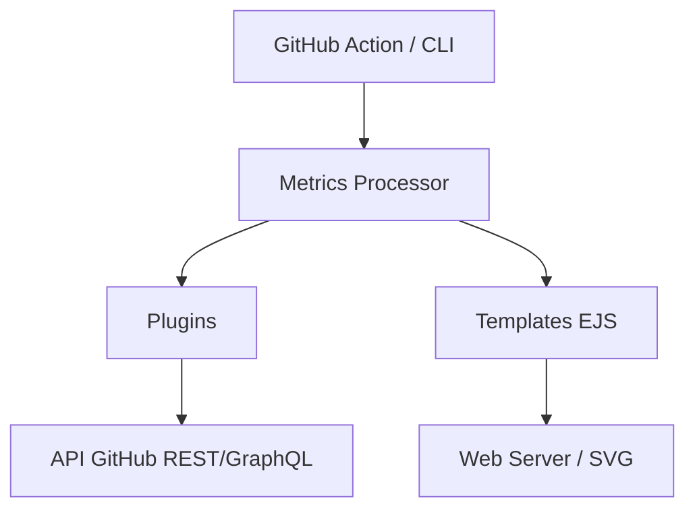

# lowlighter/metrics

> Générateur d'images SVG de statistiques GitHub à intégrer dans un profil ou un README.

## Le problème
Pour afficher son activité GitHub, ses langages ou ses stars, il faut assembler plusieurs services de badges.

## Ce que ça fait vraiment
Plus de 47 plugins (calendrier, langages, lignes de code, WakaTime, Leetcode, Steam…) et 4 gabarits.
Le mode principal tourne en GitHub Action. Il existe aussi une instance partagée, une instance web à héberger et un usage Docker ponctuel.
Les données viennent des API GitHub REST et GraphQL, puis passent dans des gabarits EJS.

## Comment c'est branché

## Essayer
Le README décrit plusieurs modes d'installation (Action, instance partagée, Docker) mais ne donne aucune commande.

## Coût et pièges
Il faut un jeton GitHub. Sur l'instance partagée, les fonctions gourmandes en calcul sont désactivées.

## Ce que ce n'est pas
Il n'a rien à voir avec la supervision de modèles ou de services. Il faut éviter la version `@master`, qui est une bêta.

## Alternatives
Le README ne nomme aucun dépôt alternatif.

## Pour toi
À ignorer : c'est un gadget de vitrine GitHub, sans rapport avec ton travail data/IA.
