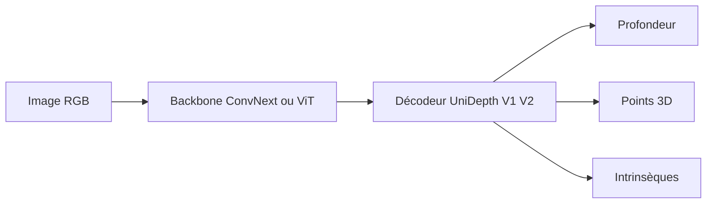

# lpiccinelli-eth/UniDepth

> Modèles de profondeur métrique à partir d'une seule image RGB, avec estimation des intrinsèques.

## Le problème
Obtenir une profondeur en mètres depuis une photo sans connaître la caméra, sur des scènes et capteurs variés.

## Ce que ça fait vraiment
Charge UniDepthV1 (CVPR 2024) ou V2 depuis Hugging Face ou TorchHub, prédit profondeur, nuage de points 3D et intrinsèques, ou utilise les intrinsèques fournis (caméras Pinhole ou Fisheye624 pour V2). V2 ajoute netteté des bords, confiance, entrées flexibles, ONNX.

## Comment c'est branché


## Essayer
```bash
pip install -e . --extra-index-url https://download.pytorch.org/whl/cu118
python ./scripts/demo.py
```
```python
from unidepth.models import UniDepthV1
model = UniDepthV1.from_pretrained("lpiccinelli/unidepth-v1-vitl14")
predictions = model.infer(rgb)
```

## Coût et pièges
Linux, Python 3.10+, CUDA 11.8+ ; opérations KNN à compiler pour l'évaluation ; erreurs xFormers/Triton possibles si les CUDA diffèrent. La licence est présente mais non identifiée. Le tableau des modèles liste `unidepth-v2-vits14` pour ViT-S et ViT-B : coquille probable.

## Ce que ce n'est pas
Pas un produit : dépôt de recherche (V2 « under submission »). Les résultats du tableau concernent V1 ; V2 y figure avec des cases vides.

## Alternatives
Comparés dans le tableau : Metric3Dv2, DepthPro, ZoeDepth, iDisc.

## Pour toi
Surveiller : bons chiffres zero-shot, mais licence non claire et dernier push en mai 2025 avant tout usage en production.

