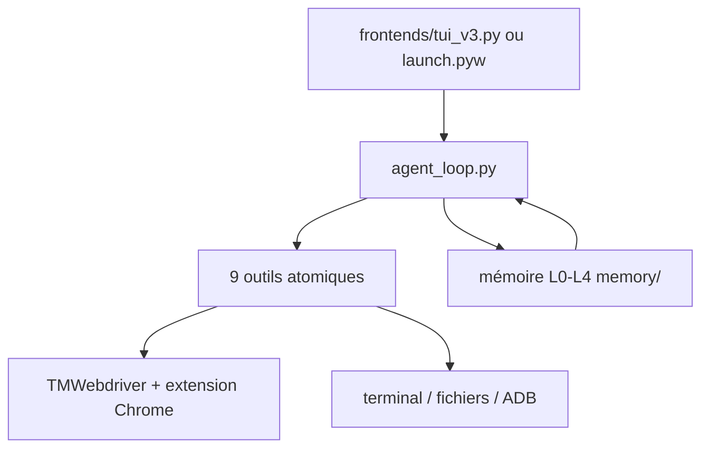

# lsdefine/GenericAgent

> Agent autonome minimal qui prend le contrôle système d'un poste et accumule ses propres compétences.

## Le problème
Les frameworks d'agents pèsent des centaines de milliers de lignes et repartent de zéro à chaque
session, sans capitaliser sur ce qu'ils ont appris.

## Ce que ça fait vraiment
~3K lignes de code, 9 outils atomiques (`code_run`, `file_read`, `file_write`, `file_patch`,
`web_scan`, `web_execute_js`, `ask_user`, plus deux outils mémoire) et une boucle d'agent d'environ
100 lignes dans `agent_loop.py`. Chaque tâche résolue est figée en « Skill » dans une mémoire
hiérarchique L0-L4. TMWebdriver injecte l'agent dans un vrai Chrome persistant, cookies et session
de connexion préservés, plutôt qu'un headless jetable.

## Comment c'est branché


## Essayer
```bash
git clone https://github.com/lsdefine/GenericAgent.git && cd GenericAgent
uv venv && uv pip install -e ".[ui]"
cp mykey_template_en.py mykey.py
python frontends/tui_v3.py
```

## Coût et pièges
Python 3.11 ou 3.12 obligatoire, pas 3.14. Clé d'API LLM à ta charge. L'installateur « une ligne »
exécute un script distant via `irm | iex` ou `curl | bash`, y compris depuis un hôte tiers
(`fudankw.cn:9000`) dans la section chinoise. Les SOP préinstallées sont en chinois.

## Ce que ce n'est pas
Ce n'est pas un agent en bac à sable : il pilote un vrai navigateur, le clavier, la souris et l'ADB
du poste. Le README revendique le contournement de détections de bots (SannySoft, reCAPTCHA v3 à
0.9) — c'est un objectif explicite du produit, pas un effet de bord. Les comparaisons de tokens et
de lignes face à Claude Code ou OpenClaw sont les chiffres de l'auteur.

## Alternatives
Le README cite OpenClaw et Claude Code comme points de comparaison, et des GUI communautaires
(`chilishark27/ga-manager`, `wangjc683/galley`, `Fwind43/GenericAgent-Admin`).

## Pour toi
Le contrôle système sans bac à sable et le contournement de détection assumé rendent l'outil
inadapté à un poste de travail professionnel.
