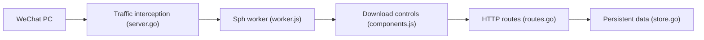

# ltaoo/wx_channels_download

> Téléchargeur de vidéos WeChat Channels (Windows, macOS) par interception du trafic du client PC.

## Le problème
Les vidéos du « Channels » WeChat ne se téléchargent pas directement depuis le client PC.

## Ce que ça fait vraiment
Lance un service local en administrateur, installe un certificat au premier démarrage et intercepte le trafic de WeChat PC. Un bouton de téléchargement est injecté dans l'interface vidéo, avec choix de qualité. Le code contient aussi une interface de gestion, des tâches de téléchargement et des scrapers d'autres plateformes. Déchiffrement inspiré de deux projets tiers cités.

## Comment c'est branché


## Essayer
```bash
# Développement (terminal lancé en administrateur)
go run main.go
# Empaquetage : voir build/build.sh
```

## Coût et pièges
Gratuit. Exige les droits administrateur et l'installation d'un certificat racine : surface de risque réelle. README en chinois.

## Ce que ce n'est pas
Pas un outil validé : disclaimer d'usage « technique et d'étude » uniquement. Licence présente mais non identifiée. Peut contrevenir aux conditions du service WeChat.

## Alternatives
Aucune nommée ; le README cite seulement WechatVideoSniffer2.0 et WechatSphDecrypt comme sources du déchiffrement.

## Pour toi
À ignorer : hors périmètre data/IA et il impose un certificat racine avec droits admin pour un gain marginal.

